### 云原生实战第五课：打通jenkins和gitlab（优化篇）
#### 课程目标：
1、优化流水线的发布流程

2、仿照之前的go项目完成一个python爬虫项目的构建


#### 背景：
整条流水线目前已全部打通，但是光打通是不够的，对于企业级环境来说仍然有很多问题。

问题一：代码提交之后没有进行单元测试、<font style="color:rgb(51,51,51);">SonarQube 扫描就直接进行了发布部署</font>

<font style="color:rgb(51,51,51);">问题二：线上环境的代码发布之前没有进行发布确认，一键推送之后就直接发布到线上环境中了风险较高</font>

<font style="color:rgb(51,51,51);">问题三：没有回滚功能，新版本发布如果出现问题，无法及时回滚老版本进行止损</font>

<font style="color:rgb(51,51,51);">问题四：develop分支(测试环境代码)合并入master分支(线上环境分支)没有进行合并校验</font>

问题五：如何确保构建的唯一性，以及如何通过pod标签查到这个pod是属于哪一次commit、哪一次构建。

### 第一部分：优化流水线的发布流程
#### 优化一：发布到线上集群添加交互式确认
强调一句话：如果是生产环境肯定不能开发人员push完毕后就直接部署到生产k8s集群中，只有develop分支才会push完自动完成整套流程发布到测试环境，所以真正在应用的时候，应该区分对待master分支与develop分支

在Jenkinsfile文件中添加交互式代码（发布线上环境时确认是否发布、回滚功能）

##### 1.1 确认是否发布功能
```python
     // 添加交互代码，确认是否要部署到生产环境
                 def userInput = input(
                    id: 'userInput',
                    message: '是否确认部署到线上环境？',
                    parameters: [
                        [
                            $class: 'ChoiceParameterDefinition',
                            choices: "Y\nN",
                            name: '是否确认部署到线上环境?'
                        ]
                    ]
                  )
                  if (userInput == "Y") {
                    // 部署到线上环境 
                    sh "kubectl set image deployment/test test=${image}"
                  }else {
                    // 任务结束
                    echo "取消本次任务"
                  }
```

<!-- 这是一张图片，ocr 内容为： -->
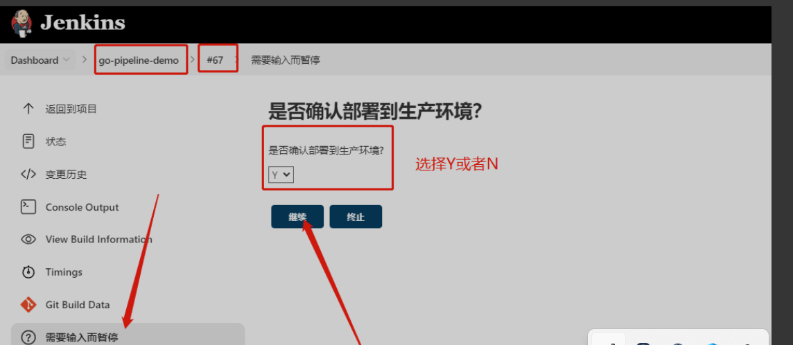

##### 1.2 回滚功能
```python
// 加入回滚功能，注意变量名不能与上面的冲突
                  def userInput2 = input(
                    id: 'userInput',
                    message: '是否需要快速回滚？',
                    parameters: [
                        [
                            $class: 'ChoiceParameterDefinition',
                            choices: "Y\nN",
                            name: '回滚?'
                        ]
                    ]
                  )
                  if (userInput2 == "Y") {
                    sh "kubectl rollout undo deployment/test"
                  } 

```

<!-- 这是一张图片，ocr 内容为： -->
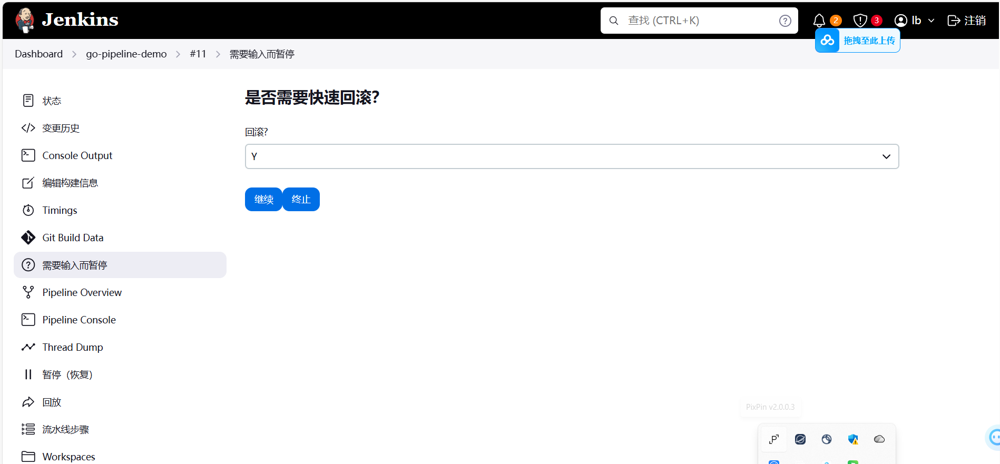

回滚前

<!-- 这是一张图片，ocr 内容为： -->
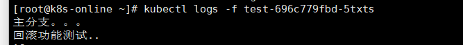

回滚后

<!-- 这是一张图片，ocr 内容为： -->
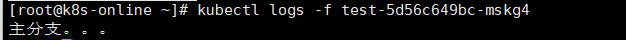


#### 优化二：为master分支设置保护规则（合并需全阶段流水线构建成功）
master分支对应线上环境，develop分支对应测试环境，需要在测试环境整套流水线发布运行无异常才能将develop分支代码合并入master分支，并将项目发布到线上环境。

清理git仓库环境，重新拉取

```python
git push origin --delete develop
git checkout master
git branch -D develop
git checkout -b develop
```

gitlab中配置(setting)只有流水线执行成功，才能合并

<!-- 这是一张图片，ocr 内容为： -->
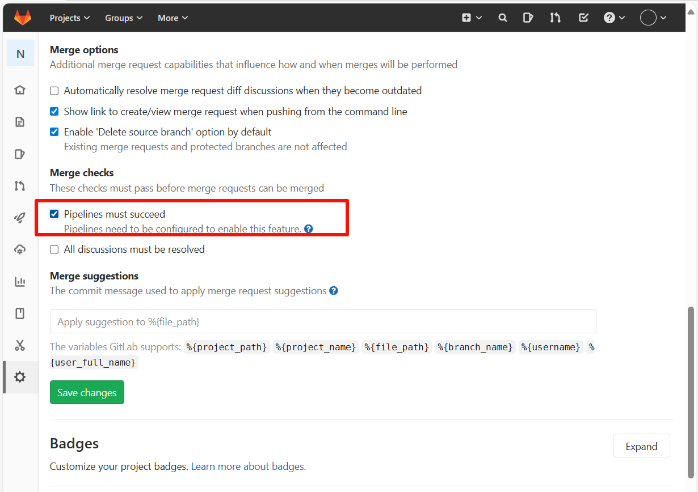

给流水线在Jenkinsfile中配置给gitlab的执行结果返回，这边采用的是调用gitlab接口的方式，大家可以思考一下别的模式可以怎么做

接口中需要有gitlab token、仓库id以及commit id

获取gitlab token，生成的token需要记录下来，刷新就看不到了

<!-- 这是一张图片，ocr 内容为： -->
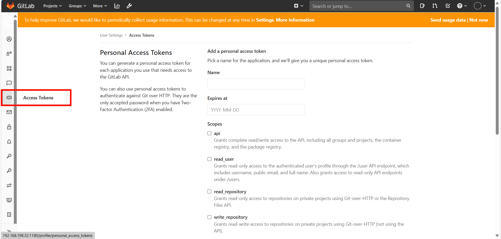

<!-- 这是一张图片，ocr 内容为：ACCESS TOKENS USER SETTINGS ADD A PERSONAL ACCESS TOKEN PERSONAL ACCESS TOKENS PICK A NAME FOR THE APPLICATION, AND WE'LL GIVE YOU A UNIQUE PERSONAL ACCESS TOKEN. I ACCESS TOKEN FOR YOU CAN GENERATE A PERSONAL AD EACH APPLICATION YOU USE THAT NEEDS ACCESS TO NAME THE GITLAB APL. TEST1 YOU CAN ALSO USE PERSONAL ACCESS TOKENS TO AUTHENTICATE AGAINST GIT OVER HTTP. THEY ARE THE EXPIRES AT ONLY ACCEPTED PASSWORD WHEN YOU HAVE TWO- YYYY-MM-DD FACTOR AUTHENTICATION (2FA) ENABLED. SCOPES API GRANTS COMPLETE READ/WRITE ACCESS TO THE API, INCLUDING ALL GROUPS AND PROJECTS, THE CONTAINER REGISTRY,AND THE PACKAGE REGISTRY. READUSER GRANTS READ-ONLY ACCESS TO THE AUTHENTICATED USER'S PROFILE THROUGH THE /USER APL ENDPOINT, WHICH INCLUDES USERNAME, PUBLIC EMAIL, AND FULL NAME. ALSO GRANTS ACCESS TO READ-ONLY APL ENDPOINTS UNDER /USERS. READ_REPOSITORY GRANTS READ-ONLY ACCESS TO REPOSITORIES ON PRIVATE PROJECTS USING GIT-OVER-HTTP OR THE REPOSITORY -->
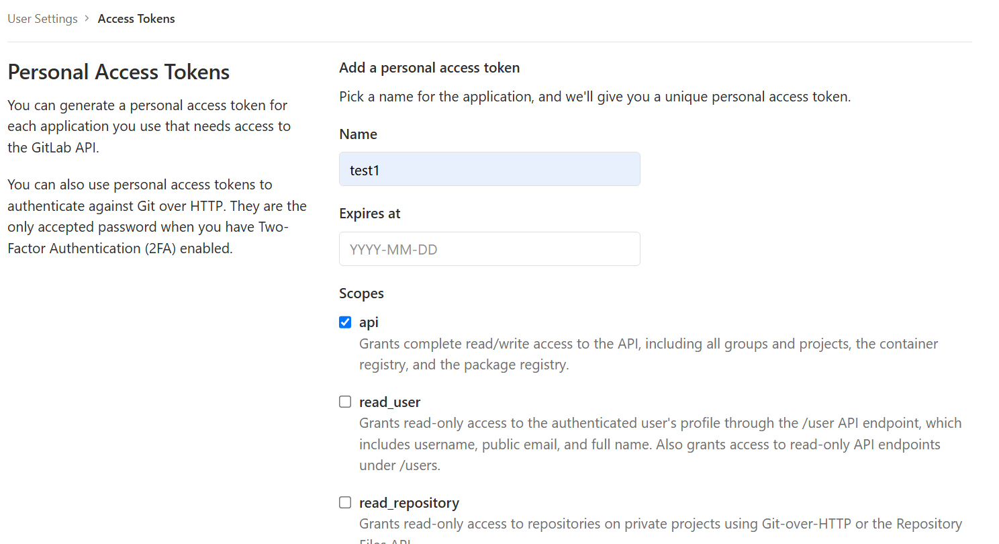

获取仓库 id

<!-- 这是一张图片，ocr 内容为： -->
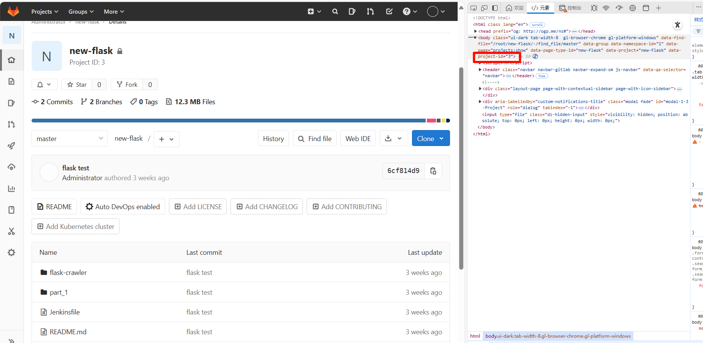


获取commit id，接口中需要传哈希值

```python
 def imageTag = sh(script: "git rev-parse --short HEAD", returnStdout: true).trim()
```

完整接口

```python
curl --request POST --header 'PRIVATE-TOKEN: tzCJW6rDVCqmEj3JvemB' 'http://192.168.198.22:1180/api/v4/projects/1/statuses/${imageTag}?state=success'  成功 
curl --request POST --header 'PRIVATE-TOKEN: tzCJW6rDVCqmEj3JvemB' 'http://192.168.198.22:1180/api/v4/projects/1/statuses/${imageTag}?state=failed'  失败
```

触发合并（develop合入master）

<!-- 这是一张图片，ocr 内容为： -->
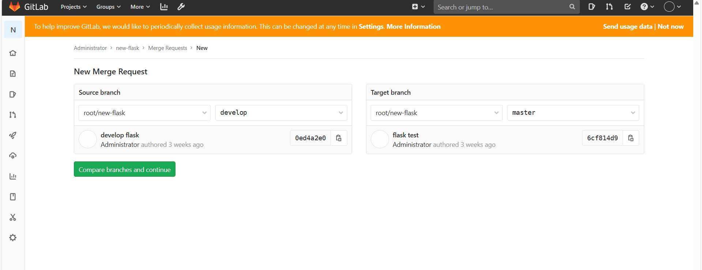

<!-- 这是一张图片，ocr 内容为： -->
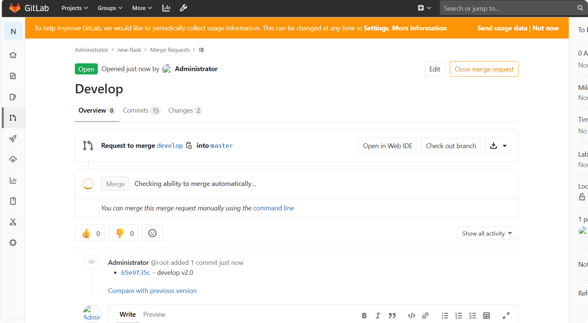

流水线执行失败时

<!-- 这是一张图片，ocr 内容为： -->
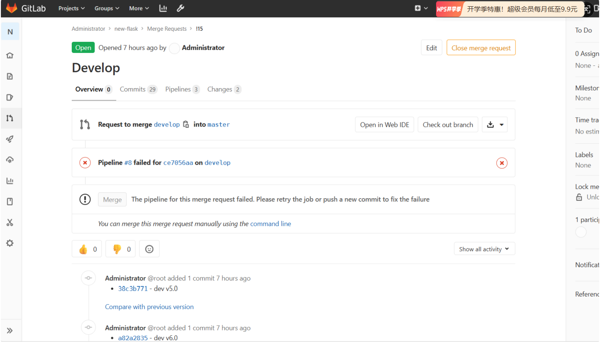

流水线执行成功时

<!-- 这是一张图片，ocr 内容为： -->
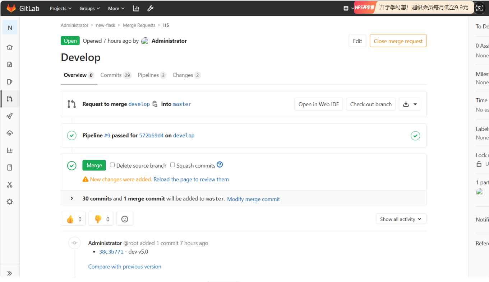


整体Jenkinsfile

```python
def label = "slave-${UUID.randomUUID().toString()}"
 
podTemplate(label: label, containers: [
  containerTemplate(name: 'jnlp', image: 'jenkins/inbound-agent:jdk21'),
  containerTemplate(name: 'golang', image: 'okteto/golang.1.17', command: 'cat', ttyEnabled: true),
  containerTemplate(name: 'docker', image: 'docker:latest', command: 'cat', ttyEnabled: true),
  containerTemplate(name: 'kubectl', image: 'cnych/kubectl', command: 'cat', ttyEnabled: true)
], serviceAccount: 'jenkins', volumes: [
  hostPathVolume(mountPath: '/var/run/docker.sock', hostPath: '/var/run/docker.sock')
]) {
  node(label) {
    def myRepo = checkout scm
    // 获取开发任意git commit -m "xxx"指定的提交信息xxx
    def gitCommit = myRepo.GIT_COMMIT
    // 获取提交的分支
    def gitBranch = myRepo.GIT_BRANCH
    echo "------------>本次构建的分支是：${gitBranch}"
    // 仓库地址
    def registryUrl = "192.168.198.22:30002"
    def imageEndpoint = "goproject/gotest"
 
    // 获取 git commit id 作为我们后面制作的docker镜像的tag
    def imageTag = sh(script: "git rev-parse --short HEAD", returnStdout: true).trim()
 
    // 镜像
    def image = "${registryUrl}/${imageEndpoint}:${imageTag}"
 
    try{
    stage('单元测试') {
      echo "1.测试阶段，此步骤略，可以根据需求自己定制"
    }
    stage('代码编译打包') {
      try {
        container('golang') {
          echo "2.代码编译打包阶段"
          sh """
            export GOPROXY=https://goproxy.cn
            GOOS=linux GOARCH=amd64 go build -v -o egongogo
            """
        }
      } catch (exc) {
        println "构建失败 - ${currentBuild.fullDisplayName}"
        throw(exc)
      }
    }
    stage('构建 Docker 镜像') {
      withCredentials([[$class: 'UsernamePasswordMultiBinding',
        credentialsId: 'docker-auth',
        usernameVariable: 'DOCKER_USER',
        passwordVariable: 'DOCKER_PASSWORD']]) {
          container('docker') {
            echo "3. 构建 Docker 镜像阶段"
sh '''
cat >Dockerfile<<EOF
FROM centos:8
USER root
COPY ./egongogo /opt/
RUN chmod +x /opt/egongogo
CMD /opt/egongogo
EOF'''
            sh """
              docker login ${registryUrl} -u ${DOCKER_USER} -p ${DOCKER_PASSWORD}
              docker build -t ${image} .
              docker push ${image}
              """
          }
      }
    }
    stage('运行 Kubectl') {
      container('kubectl') {
        script {
            if ("${gitBranch}" == 'origin/master') {
              withCredentials([file(credentialsId: 'kubeconfig-shengchan', variable: 'KUBECONFIG')]) {
                 echo "查看生产 K8S 集群 Pod 列表"
                 sh 'echo "${KUBECONFIG}"'
                 sh 'mkdir -p ~/.kube && /bin/cp "${KUBECONFIG}" ~/.kube/config'
                 sh "kubectl get pods"
                  
                 // 添加交互代码，确认是否要部署到线上环境
                 def userInput = input(
                    id: 'userInput',
                    message: '是否确认部署到线上环境？',
                    parameters: [
                        [
                            $class: 'ChoiceParameterDefinition',
                            choices: "Y\nN",
                            name: '是否确认部署到线上环境?'
                        ]
                    ]
                  )
                  if (userInput == "Y") {
                    // 部署到线上环境 
                    sh "kubectl set image deployment/test test=${image}"
                  }else {
                    // 任务结束
                    echo "取消本次任务"
                  } 

                  // 加入回滚功能，注意变量名不能与上面的冲突
                  def userInput2 = input(
                    id: 'userInput',
                    message: '是否需要快速回滚？',
                    parameters: [
                        [
                            $class: 'ChoiceParameterDefinition',
                            choices: "Y\nN",
                            name: '回滚?'
                        ]
                    ]
                  )
                  if (userInput2 == "Y") {
                    sh "kubectl rollout undo deployment/test"
                  } 
                  
              }
            }else if("${gitBranch}" == 'origin/develop'){
              withCredentials([file(credentialsId: 'kubeconfig-ceshi', variable: 'KUBECONFIG')]) {
                 echo "查看测试 K8S 集群 Pod 列表"
                 sh 'mkdir -p ~/.kube && /bin/cp "${KUBECONFIG}" ~/.kube/config'
                 sh "kubectl get pods -n kube-system"
                 sh "kubectl set image deployment test test=${image}"
              }
            }
        }
      } 
    }
    sh "curl --request POST --header 'PRIVATE-TOKEN: tzCJW6rDVCqmEj3JvemB' 'http://192.168.198.22:1180/api/v4/projects/1/statuses/${imageTag}?state=success'"
   } catch (Exception e) {
     sh "curl --request POST --header 'PRIVATE-TOKEN: tzCJW6rDVCqmEj3JvemB' 'http://192.168.198.22:1180/api/v4/projects/1/statuses/${imageTag}?state=failed'"
      error "Build failed"
   }
   }
}

```


#### 补充扩展
##### 单元测试
单元测试是一种验证代码正确性的重要方法，通常使用内置的 unittest 模块或第三方框架 pytest 来编写和运行测试用例。

通常分为4个部分

1.测试发现：从多个文件里面去找到我们的测试用例

2.测试执行：按照一定的顺序和规则去执行，并生成结果

3.测试判断：通过断言判断预期结果和实际结果的差异

4.测试报告：统计测试进度、耗时、通过率、生成测试报告（coverage工具）

例如，我们在编写一个简单的加法函数时：

```python
def add(x, y):
    return x + y
```

<font style="color:rgb(25, 27, 31);">我们可以通过编写一个简单的单元测试，来保证这个函数的功能：</font>

```python
import unittest

class TestAdd(unittest.TestCase):
    def test_add(self):
        self.assertEqual(add(1, 2), 3)
```

calc.go 

```yaml
package main

// Add 返回两个整数的和
func Add(a, b int) int {
	return a + b
}

// Sub 返回两个整数的差（a - b）
func Sub(a, b int) int {
	return a - b
}

// IsEven 判断一个整数是否为偶数
func IsEven(n int) bool {
	return n%2 == 0
}

```

calc_test.go

```yaml
package main

import "testing"

// 表驱动测试（table-driven test）是 Go 单元测试的标准写法：
// 把多组输入/期望输出放在一张表里，一次遍历全部验证
func TestAdd(t *testing.T) {
	tests := []struct {
		name string // 用例名，失败时便于定位
		a    int
		b    int
		want int
	}{
		{"两个正数相加", 1, 2, 3},
		{"两个负数相加", -1, -2, -3},
		{"一正一负相加", -1, 1, 0},
		{"与零相加", 0, 5, 5},
	}
	for _, tt := range tests {
		// t.Run 让每组数据成为控制台输出里的一个子测试，-v 模式下可单独看到每个子用例的通过情况
		t.Run(tt.name, func(t *testing.T) {
			if got := Add(tt.a, tt.b); got != tt.want {
				t.Errorf("Add(%d, %d) = %d, 期望 %d", tt.a, tt.b, got, tt.want)
			}
		})
	}
}

func TestSub(t *testing.T) {
	tests := []struct {
		name string
		a    int
		b    int
		want int
	}{
		{"大数减小数", 5, 3, 2},
		{"小数减大数为负", 3, 5, -2},
		{"相等相减为零", 4, 4, 0},
	}
	for _, tt := range tests {
		t.Run(tt.name, func(t *testing.T) {
			if got := Sub(tt.a, tt.b); got != tt.want {
				t.Errorf("Sub(%d, %d) = %d, 期望 %d", tt.a, tt.b, got, tt.want)
			}
		})
	}
}

func TestIsEven(t *testing.T) {
	if !IsEven(4) {
		t.Errorf("IsEven(4) 应为 true")
	}
	if IsEven(7) {
		t.Errorf("IsEven(7) 应为 false")
	}
	if !IsEven(0) {
		t.Errorf("IsEven(0) 应为 true")
	}
}

```

```python
                                                                                                                      
 ✨ calc.go和calc_test.go的区别                                                                                         
                                                                                                                        
 ● User asks: what's the difference between calc.go and calc_test.go? Simple conceptual question. Explain:              
   - calc.go: the actual source code being tested (business logic)                                                      
   ... (6 more lines, ctrl+o to expand)                                                                                 
                                                                                                                        
 ● 一个是被测的代码，一个是测它的代码，关系对应 calc.go ← calc_test.go：                                                
                                                                                                                        
   calc.go —— 业务源码                                                                                                  
   • 写真正干活的函数：Add、Sub、IsEven                                                                                 
   • go build 时会编译进最终的可执行文件（egongogo 镜像里的东西）                                                       
   • 也就是"产品"                                                                                                       
                                                                                                                        
   calc_test.go —— 测试代码                                                                                             
   • 写验证这些函数对不对的用例：TestAdd 调 Add(1,2) 断言结果必须是 3，不对就报错                                       
   • 也就是"质检员"                                                                                                     
                                                                                                                        
   为什么文件名要这么起——这是 Go 的硬性约定，不是随便命名的：                                                           
                                                                                                                        
   1. 后缀 _test.go：Go 工具链靠这个后缀识别测试文件。普通 go build 会完全忽略它（不会打进二进制）；只有执行 go test 时 
      才编译它                                                                                                          
   2. 函数名 Test 开头：go test 只运行 TestXxx 格式的函数，所以必须叫 TestAdd 而不是 CheckAdd                           
   3. 同一个 package（package main）、同一个目录：测试代码能直接调用被测函数（Add 而不是 main.Add），不需要 import      
                                                                                                                        
   一句话总结：改功能改 calc.go，加验证改 calc_test.go——流水线里 go build 用前者做产品，go test 用后者做质检，测试挂了  
   （比如有人把 Add 改成 a-b）构建就失败，坏代码到不了 Harbor。                                                         
                                                                                                                        
 ✨ testadd testsub 和testiseven的区别                                                                                  
                                                                                                                        
 ● The user asks about the difference between TestAdd, TestSub and TestIsEven in calc_test.go. Explain the two test     
   styles:                                                                                                              
   ... (8 more lines, ctrl+o to expand)                                                                                 
                                                                                                                        
 ● 两者都是合法的测试函数，区别在写法风格——前两个是"表驱动"，后一个是"顺序断言"：                                       
                                                                                                                        
   TestAdd / TestSub —— 表驱动测试（Go 的标准写法）                                                                     
                                                                                                                        
   ```go                                                                                                                
     tests := []struct{ name string; a, b, want int }{                                                                  
         {"两个正数相加", 1, 2, 3},                                                                                     
         {"两个负数相加", -1, -2, -3},                                                                                  
         ...                                                                                                            
     }                                                                                                                  
     for _, tt := range tests {                                                                                         
         t.Run(tt.name, func(t *testing.T) { ... })                                                                     
     }                                                                                                                  
   ```                                                                                                                  
                                                                                                                        
   把多组"输入 → 期望输出"列成一张表，循环遍历验证。每行数据通过 t.Run 变成一个独立子测试，控制台里能看到每个子用例单独 
   PASS/FAIL。                                                                                                          
                                                                                                                        
   TestIsEven —— 顺序断言（传统写法）                                                                                   
                                                                                                                        
   ```go                                                                                                                
     if !IsEven(4) { t.Errorf(...) }                                                                                    
     if IsEven(7)  { t.Errorf(...) }                                                                                    
     if !IsEven(0) { t.Errorf(...) }                                                                                    
   ```                                                                                                                  
                                                                                                                        
   一行一行手写每个检查，没有循环和子测试结构。                                                                         
                                                                                                                        
   对比和取舍：                                                                                                         
                                                                                                                        
   ┌──────────┬─────────────────────────┬───────────────────────────────┐                                               
   │          │ 表驱动                  │ 顺序断言                      │                                               
   ├──────────┼─────────────────────────┼───────────────────────────────┤                                               
   │ 新增用例 │ 表里加一行              │ 复制粘贴三行                  │                                               
   ├──────────┼─────────────────────────┼───────────────────────────────┤                                               
   │ 失败定位 │ 直接显示是哪个子用例红  │ 看行号排查                    │                                               
   ├──────────┼─────────────────────────┼───────────────────────────────┤                                               
   │ 适合场景 │ 输入/输出组合多的纯函数 │ 检查点少、或带副作用/布尔逻辑 │                                               
   └──────────┴─────────────────────────┴───────────────────────────────┘                                               
                                                                                                                        
   我在文件里故意两种都写了：Add/Sub 参数组合多，表驱动优势明显；IsEven 只验证三个布尔场景，顺序写更直观。实际项目里输  
   入输出明确的函数一律推荐表驱动——这是 Go 官方和大型项目的通用惯例（标准库源码里到处都是）。     
```

<!-- 这是一张图片，ocr 内容为：1.单元测试阶段 [PIPELINE] SH GIT CONFIG CORE.SPARSECHECKOUT # TIMEOUT-10  GIT CHECKOUT -F COBD52057AD66928AABEBE4D6DCOECAE9F8486 # TIMEOUT-10 EXPORT GOPROXY-HTTPS://GOPROXY.CN ST -Y -COVERPROFILE COVERAGE.OUT ./.. GO TEST-V TESTADD TESTADD/两个正数相加 TESTADD/两个负数相加 TESTADD/一正一负相加 RUN TESTADD/与零相加 RUN PASS:TESTADD(0.00S) PASS:TESTADD/两个正数相加(0.00S) PASS:TESTADD/两个负数相加(0.00S) ---PASS:TESTADD/一正一负相加(0.00S) ---PASS:TESTADD/与零相加(0.00S) TESTSUB RUN TESTSUB/大数减小数 三三 RUN TESTSUB/小数减大数为负 RUN TESTSUB/相等相减为零 RUN PASS: TESTSUB (0.00S) ---PASS:TESTSUB/大数减小数(0.00S) ---PASS:TESTSUB/小数减大数为负(0.00S) ---PASS:TESTSUB/相等相减为零(0.00S) TESTISEVEN PASS: TESTISEVEN (0.00S) PASS COVERAGE:60.0% % OF STATEMENTS GOLANG 0.004S COVERAGE:60.0% OF STATEMENTS OK S GO TOOL COVER -FUNCECOVERAGE.OUT 100.0% ADD GOLANG/CALC.GO:4: SUB 100.0% GOLANG/CALC.GO:9: 100.0% ISEVEN GOLANG/CALC.GO:14: 0.0% MAIN GOLANG/RUN.GO:8: (STATEMENTS) 60.0% TOTAL: GO TOOL COVER -HTML-COVERAGE.OUT -O COVERAGE.HTML [PIPELINE]] [PIPELINE] // CONTAINER [PIPELINE] ARCHIVEARTIFACTS ARCHIVING ARTIFACTS [PIPELINE] ] [PIPELINE] // STAGE [PIPELINE] STAGE [PIPELINE]{代码编译打包) [PIPELINE] CONTAINER [PIPELINE] { [PIPELINE] ECHO 2.代码编译打包阶段 [PIPELINE] SH EXPORT GOPROXY-HTTPS://GOPROXY.CN GOOS-LINUX GOARCH-AMD64 GO BUILD -V -O EGONGOGO -->
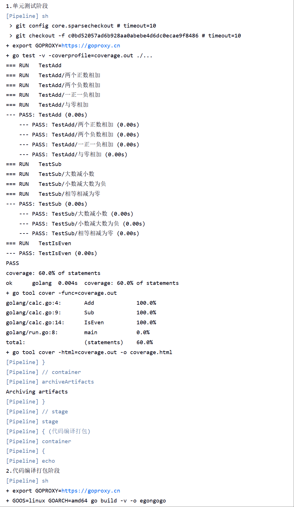

<!-- 这是一张图片，ocr 内容为：JENKINSTTEST-GO 状态 TEST-GO ADD DESCRIPTION 变更历史 上次成功的成品 2.76 KIB 立即构建 VIEW COVERAGE.HTML 相关链接 删除PIPELINE CONFIGURE 最近一次构建(#15),1天3小时之前 最近稳定构建(#15),1天3小时之前 重命名 最近成功的构建(#15),1天3小时之前 最近失败的构建(#11),1天4小时之前 STAGES 最近未成功的构建(#11),1天4小时之前 最近完成的构建(#15),1天3小时之前 流水线语法 BUILDS 过滤构建... 2026年9月6日 #15  11:49 井14 11:30 -->
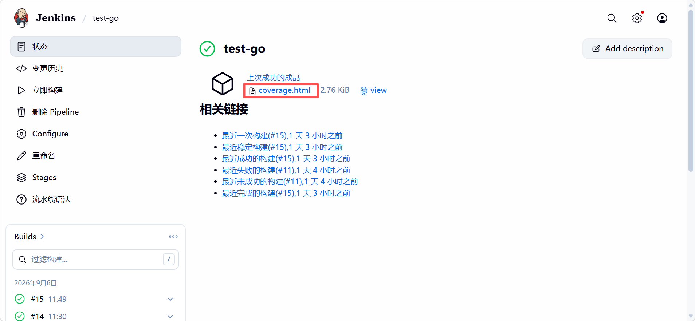

已覆盖的是绿色的

<!-- 这是一张图片，ocr 内容为：不安全192.168.198.22:7096/IOB/TEST-GO/15/ARTIFACT/COVERAGE.HTML#FILEO LGOLANG/CALC.GO(100.0%) NOT TRACKED NOT COVERED COVERED PACKAGE MAIN /ADD返回两个整数的和 FUNC ADD(A, B INT) INT HO RETURN A + B 1/SUB返回两个整数的差(A-B) FUNC SUB(A, INT) INT TO RETURN A - B 判断一个整数是否为偶数 /ISEVEN判 S ISEVEN(N INT) BOOL FOOL FUNC RETURN N%2 - -->
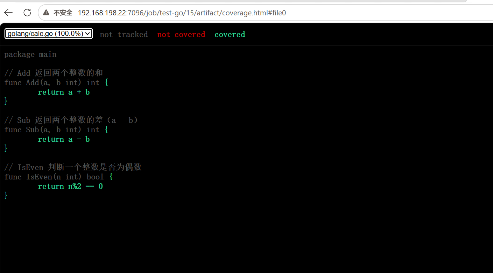

未覆盖的红色的

<!-- 这是一张图片，ocr 内容为：TRACKED GOLANG/RUN.GO(0.0%) NOT COVERED COVERED NOT PACKAGE MAIN IMPORT ( "FMT' "TIME" FUNC MAIN FMT.PRINTIN("开发分支. TIME.SLEEP(10000000 * TIME. SECOND) -->
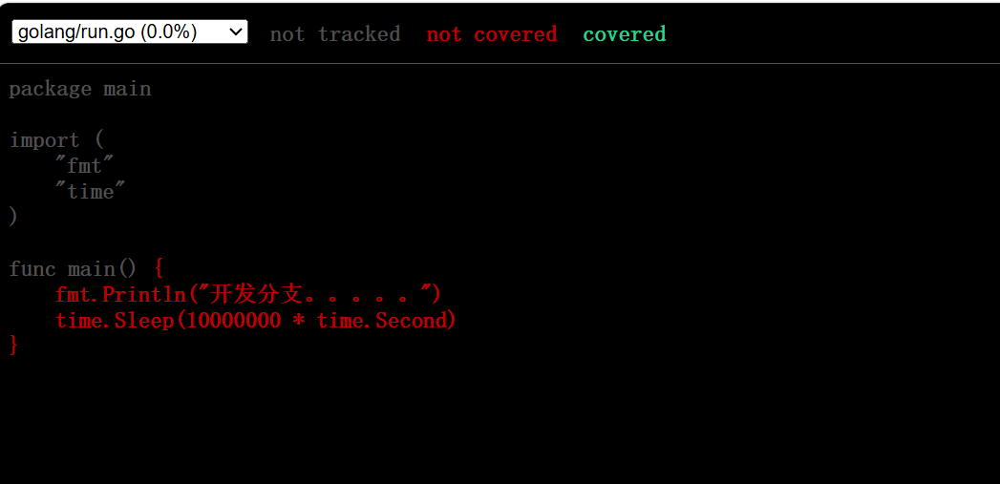

##### SonarQube扫描
SonarQube 是一个开源的代码质量管理平台，可以检测代码中的漏洞、重复代码、代码复杂度等问题

主要步骤

<font style="color:rgb(79, 79, 79);">1.安装 SonarQube</font>

<font style="color:rgb(79, 79, 79);">2.配置 Jenkins 与 SonarQube的互访</font>

<font style="color:rgb(79, 79, 79);">3.Jenkins 流水线集成 SonarQube（安装插件、编写Jenkinsfile）</font>

##### <font style="color:rgba(0, 0, 0, 0.75);">  
</font><font style="color:rgba(0, 0, 0, 0.75);">冒烟测试</font>
<font style="color:rgb(25, 27, 31);">在软件发布前快速验证系统的关键功能能否正常运作。</font>

##### 
##### 构建稳定性处理
构建时引入digest，digest=镜像内容哈希(构建产物)。同一个commit 构建两次，tag相同但digest 不同(构建时间戳等层会变)——这也是我们部署时用tag@digest的原因:tag告诉你"哪份代码”，digest告诉你"哪次构建的产物”。

为什么要引入digest

```python
第一次构建（push 触发或手动点的都行）：
  checkout → HEAD 是 a1b2c3 → 打镜像 → push gotest:a1b2c3
                                        ↑ 此刻仓库里 a1b2c3 = 内容甲

没人 push 新代码，commit还是原来的，直接在 Jenkins 再点一次构建：
  checkout → HEAD 还是 a1b2c3（分支没动）
           → go build 重新走一遍
           → FROM centos:8 重新拉一遍（可能已更新）
           → go 依赖重新从 goproxy.cn 拉一遍（版本可能漂移）
           → 打出来的镜像可能是 内容乙
           → push gotest:a1b2c3   ← tag 被静默覆盖，仓库里 a1b2c3 从甲变成了乙
```

```yaml
def label = "slave-${UUID.randomUUID().toString()}"
 
podTemplate(label: label, containers: [
  containerTemplate(name: 'jnlp', image: 'jenkins/inbound-agent:jdk21'),
  containerTemplate(name: 'golang', image: 'okteto/golang.1.17', command: 'cat', ttyEnabled: true),
  containerTemplate(name: 'docker', image: 'docker:latest', command: 'cat', ttyEnabled: true),
  containerTemplate(name: 'kubectl', image: 'cnych/kubectl', command: 'cat', ttyEnabled: true)
], serviceAccount: 'jenkins', volumes: [
  hostPathVolume(mountPath: '/var/run/docker.sock', hostPath: '/var/run/docker.sock')
]) {
  node(label) {
    def myRepo = checkout scm
    // 获取开发任意git commit -m "xxx"指定的提交信息xxx
    def gitCommit = myRepo.GIT_COMMIT
    // 获取提交的分支
    def gitBranch = myRepo.GIT_BRANCH
    echo "------------>本次构建的分支是：${gitBranch}"
    // 仓库地址
    def registryUrl = "192.168.198.22:30002"
    def imageEndpoint = "goproject/gotest"
 
    // 获取完整 git commit id 作为镜像tag（完整SHA，避免短SHA前缀碰撞，支持从tag反查commit）
    def imageTag = sh(script: "git rev-parse HEAD", returnStdout: true).trim()

    // 镜像
    def image = "${registryUrl}/${imageEndpoint}:${imageTag}"
    // 镜像不可变引用（tag@digest），push 之后回填
    def imageWithDigest = image
 
    try{
    stage('单元测试') {
      container('golang') {
        echo "1.单元测试阶段"
        sh """
          export GOPROXY=https://goproxy.cn
          go test -v -coverprofile=coverage.out ./...
          go tool cover -func=coverage.out
          go tool cover -html=coverage.out -o coverage.html
        """
      }
      archiveArtifacts artifacts: 'coverage.html', allowEmptyArchive: true
    }
    stage('代码编译打包') {
      try {
        container('golang') {
          echo "2.代码编译打包阶段"
          sh """
            export GOPROXY=https://goproxy.cn
            GOOS=linux GOARCH=amd64 go build -v -o egongogo
            """
        }
      } catch (exc) {
        println "构建失败 - ${currentBuild.fullDisplayName}"
        throw(exc)
      }
    }
    stage('构建 Docker 镜像') {
      withCredentials([[$class: 'UsernamePasswordMultiBinding',
        credentialsId: 'docker-auth',
        usernameVariable: 'DOCKER_USER',
        passwordVariable: 'DOCKER_PASSWORD']]) {
          container('docker') {
            echo "3. 构建 Docker 镜像阶段"
sh '''
cat >Dockerfile<<EOF
FROM centos:8
USER root
COPY ./egongogo /opt/
RUN chmod +x /opt/egongogo
CMD /opt/egongogo
EOF'''
            sh """
              docker login ${registryUrl} -u ${DOCKER_USER} -p ${DOCKER_PASSWORD}
              docker build -t ${image} .
              docker push ${image}
              """
            // 获取推送后镜像的 digest，组成不可变引用 tag@digest（不能用 def，后续 stage 还要用）
            imageDigest = sh(script: "docker inspect --format='{{index .RepoDigests 0}}' ${image} | cut -d'@' -f2", returnStdout: true).trim()
            imageWithDigest = "${image}@${imageDigest}"
            echo "------------>镜像不可变引用：${imageWithDigest}"
          }
      }
    }
    stage('运行 Kubectl') {
      container('kubectl') {
        script {
            if ("${gitBranch}" == 'origin/master') {
              withCredentials([file(credentialsId: 'kubeconfig-shengchan', variable: 'KUBECONFIG')]) {
                 echo "查看生产 K8S 集群 Pod 列表"
                 sh 'echo "${KUBECONFIG}"'
                 sh 'mkdir -p ~/.kube && /bin/cp "${KUBECONFIG}" ~/.kube/config'
                 sh "kubectl get pods"
                  
                 // 添加交互代码，确认是否要部署到线上环境
                 def userInput = input(
                    id: 'userInput',
                    message: '是否确认部署到线上环境？',
                    parameters: [
                        [
                            $class: 'ChoiceParameterDefinition',
                            choices: "Y\nN",
                            name: '是否确认部署到线上环境?'
                        ]
                    ]
                  )
                  if (userInput == "Y") {
                    // 部署到线上环境（使用不可变引用，并记录 change-cause 便于追溯）
                    sh "kubectl set image deployment/test test=${imageWithDigest}"
                    sh "kubectl annotate deployment/test kubernetes.io/change-cause='build#${BUILD_NUMBER} ${imageWithDigest}' --overwrite"
                  }else {
                    // 任务结束
                    echo "取消本次任务"
                  } 

                  // 加入回滚功能，注意变量名不能与上面的冲突
                  def userInput2 = input(
                    id: 'userInput',
                    message: '是否需要快速回滚？',
                    parameters: [
                        [
                            $class: 'ChoiceParameterDefinition',
                            choices: "Y\nN",
                            name: '回滚?'
                        ]
                    ]
                  )
                  if (userInput2 == "Y") {
                    sh "kubectl rollout undo deployment/test"
                  } 
                  
              }
            }else if("${gitBranch}" == 'origin/develop'){
              withCredentials([file(credentialsId: 'kubeconfig-ceshi', variable: 'KUBECONFIG')]) {
                 echo "查看测试 K8S 集群 Pod 列表"
                 sh 'mkdir -p ~/.kube && /bin/cp "${KUBECONFIG}" ~/.kube/config'
                 sh "kubectl get pods -n kube-system"
                 sh "kubectl set image deployment test test=${imageWithDigest}"
                 sh "kubectl annotate deployment test kubernetes.io/change-cause='build#${BUILD_NUMBER} ${imageWithDigest}' --overwrite"
              }
            }
        }
      } 
    }
    sh "curl --request POST --header 'PRIVATE-TOKEN: tzCJW6rDVCqmEj3JvemB' 'http://192.168.198.22:1180/api/v4/projects/1/statuses/${imageTag}?state=success'"
   } catch (Exception e) {
     sh "curl --request POST --header 'PRIVATE-TOKEN: tzCJW6rDVCqmEj3JvemB' 'http://192.168.198.22:1180/api/v4/projects/1/statuses/${imageTag}?state=failed'"
      error "Build failed"
   }
   }
}

```

```python
kubectl get pods test-55b6d6479c-2p8676 -o jsonpath='{.spec.containers[*].image}'
```

<!-- 这是一张图片，ocr 内容为：[ROOT@K8S-CICD-PROD ~]# KUBECTL GE ETT GET PODS TEST-5DDDDDCCBB5-68A56 -O ISONPATH- NERS D8649ELCEAE4EF1732AB96354289895695695F9;(SHA256: LE80C097CE4C1315B22357FE4EBEE73 192.168.198.22:30002/GOPROJECT/GOTEST -->
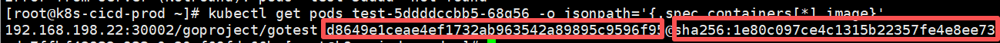

<!-- 这是一张图片，ocr 内容为：ADMINISTRATOR > REDHAT > COMMITS > D8649ELC COMMITD8649ELC AUTHORED 43 MINUTES AGO BY ADMINISTRATOR BROWSE FILES OPTIONS MERGE BRANCH 'DEVELOP' CONFLICTS: JENKINSFILE RUN.GO PARENTS 1BA95A36 E4255907 PMASTER NO RELATED MERGE REQUESTS FOUND CHANGES SHOWING 3 CHANGED FILES > WITH 99 ADDITIONS AND 7 DELETIONS SIDE-BY-SIDE INLINE HIDE WHITESPACE CHANGES VIEW FILE@ D8649ELC JENKINSFILE -->
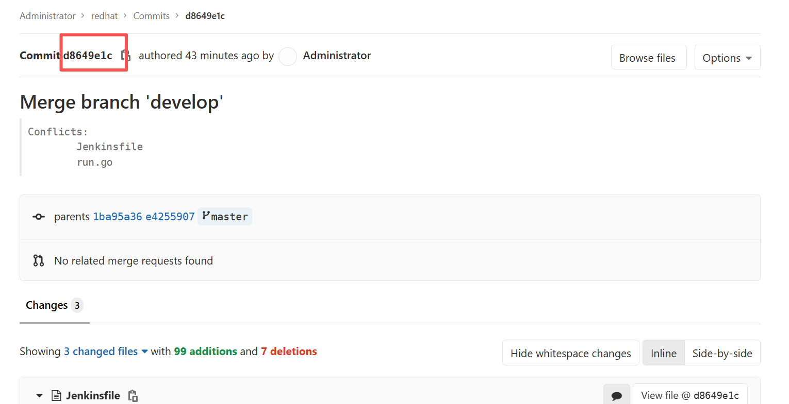


### 第二部分：完成python爬虫项目的构建
##### 2.1 按照之前的思路，分为如下步骤
1、创建python 爬虫的gitlab仓库（之前已创建）

2、harbor创建一个存放python 爬虫镜像的仓库

3、在jenkins新建一条构建python爬虫项目的流水线，并打通gitlab

4、修改Jenkinsfile文件


##### 2.2 企业级项目目录结构
```python
/flask-crawler
├── app/                  # 核心应用代码
│   ├── __init__.py       # 应用工厂函数
│   ├── routes.py         # 主路由入口
│   ├── crawlers/         # 爬虫模块
│   │   ├── __init__.py
│   │   ├── douban.py     # 豆瓣爬虫实现
│   │   ├── weibo.py      # 微博爬虫（预留扩展）
│   │   └── base.py       # 爬虫抽象基类
│   ├── models/           # 数据模型
│   │   ├── __init__.py
│   │   └── result.py     # 爬虫结果模型
│   ├── services/         # 业务逻辑层（预留）
│   ├── utils/            # 工具函数
│   │   ├── logger.py     # 日志配置
│   │   └── validator.py  # 参数校验
│   ├── config.py         # 配置管理
│   └── extensions.py     # 扩展初始化
├── tests/                # 测试用例
│   ├── unit/             # 单元测试
│   └── functional/       # 功能测试
├── migrations/           # 数据库迁移脚本（自动生成）
├── requirements.txt      # 依赖清单
├── Dockerfile            # 容器构建文件
├── docker-compose.yml    # 本地开发环境
├── .dockerignore         # 容器排除文件
├── deploy/               # 部署配置
│   └── k8s/
│       ├── mysql/        # 数据库部署文件
│       └── app/          # 应用部署文件
└── scripts/              # 运维脚本
    ├── init_db.py        # 数据库初始化
    └── healthcheck.sh    # 健康检查
```


##### 2.3 Jenkinsfile（dockerfile展开版）
```python
def label = "slave-${UUID.randomUUID().toString()}"

podTemplate(label: label, containers: [
  containerTemplate(name: 'python', image: 'python:3.11-alpine', command: 'cat', ttyEnabled: true),
  containerTemplate(name: 'docker', image: 'docker:latest', command: 'cat', ttyEnabled: true),
  containerTemplate(name: 'kubectl', image: 'cnych/kubectl', command: 'cat', ttyEnabled: true)
], serviceAccount: 'jenkins', volumes: [
  hostPathVolume(mountPath: '/var/run/docker.sock', hostPath: '/var/run/docker.sock')
]) {
  node(label) {
    def myRepo = checkout scm
    // 获取开发任意git commit -m "xxx"指定的提交信息xxx
    def gitCommit = myRepo.GIT_COMMIT
    // 获取提交的分支
    def gitBranch = myRepo.GIT_BRANCH
    echo "------------>本次构建的分支是：${gitBranch}"
    // 仓库地址
    def registryUrl = "192.168.198.32:30002"
    def imageEndpoint = "flask/pythontest"
 
    // 获取 git commit id 作为我们后面制作的docker镜像的tag
    def imageTag = sh(script: "git rev-parse --short HEAD", returnStdout: true).trim()
 
    // 镜像
    def image = "${registryUrl}/${imageEndpoint}:${imageTag}"
 
    stage('单元测试') {
      echo "1.测试阶段，此步骤略，可以根据需求自己定制"
    }
    stage('构建 Docker 镜像') {
      withCredentials([[$class: 'UsernamePasswordMultiBinding',
        credentialsId: 'docker-auth',
        usernameVariable: 'DOCKER_USER',
        passwordVariable: 'DOCKER_PASSWORD']]) {
          container('docker') {
            echo "3. 构建 Docker 镜像阶段"
sh '''
cat >Dockerfile<<EOF
# 第一阶段：构建依赖
FROM python:3.11-alpine AS builder

# 创建运行时用户
RUN addgroup -S appuser && adduser -S appuser -G appuser \
    && mkdir -p /home/appuser/.local \
    && chown -R appuser:appuser /home/appuser

USER appuser
WORKDIR /app
COPY requirements.lock .
RUN pip install --user --no-cache-dir -r requirements.lock \
    -i https://pypi.tuna.tsinghua.edu.cn/simple

# 第二阶段：运行时
FROM python:3.11-alpine

RUN addgroup -S appuser && adduser -S appuser -G appuser \
    && mkdir -p /home/appuser/.local \
    && chown -R appuser:appuser /home/appuser

# 配置阿里云镜像源
RUN sed -i 's/dl-cdn.alpinelinux.org/mirrors.aliyun.com/g' /etc/apk/repositories \
    && apk update \
    && apk add --no-cache curl \
    && rm -rf /var/cache/apk/*

WORKDIR /app

# 复制依赖（确保路径一致）
COPY --from=builder --chown=appuser:appuser /home/appuser/.local /home/appuser/.local
COPY --chown=appuser:appuser . .

ENV PATH="/home/appuser/.local/bin:$PATH" \
    PYTHONPATH="/app" \
    GUNICORN_WORKERS=4

USER appuser
EXPOSE 5000

HEALTHCHECK --interval=30s --timeout=10s \
  CMD curl -fs http://localhost:5000/health || exit 1

CMD ["gunicorn", "-w", "4", "-b", "0.0.0.0:5000", "wsgi:app"]
EOF'''
            sh """
              docker login ${registryUrl} -u ${DOCKER_USER} -p ${DOCKER_PASSWORD}
              docker build -t ${image} .
              docker push ${image}
              """
          }
      }
    }
    stage('运行 Kubectl') {
      container('kubectl') {
        script {
            if ("${gitBranch}" == 'origin/master') {
              withCredentials([file(credentialsId: 'kubeconfig-shengchan', variable: 'KUBECONFIG')]) {
                 echo "查看生产 K8S 集群 Pod 列表"
                 sh 'echo "${KUBECONFIG}"'
                 sh 'mkdir -p ~/.kube && /bin/cp "${KUBECONFIG}" ~/.kube/config'
                 sh "kubectl get pods"
                 sh "kubectl set image deployment/test test=${image}"
              }
            }else if("${gitBranch}" == 'origin/develop'){
              withCredentials([file(credentialsId: 'kubeconfig-ceshi', variable: 'KUBECONFIG')]) {
                 echo "查看测试 K8S 集群 Pod 列表"
                 sh 'mkdir -p ~/.kube && /bin/cp "${KUBECONFIG}" ~/.kube/config'
                 sh "kubectl get pods -n kube-system"
                 sh "kubectl set image deployment test test=${image}"
              }
            }
        }
      } 
    }
  }
}

```

##### 2.4 优化Jenkinsfile
```python
def label = "slave-${UUID.randomUUID().toString()}"

podTemplate(label: label, containers: [
  containerTemplate(name: 'python', image: 'python:3.11-alpine', command: 'cat', ttyEnabled: true),
  containerTemplate(name: 'docker', image: 'docker:latest', command: 'cat', ttyEnabled: true),
  containerTemplate(name: 'kubectl', image: 'cnych/kubectl', command: 'cat', ttyEnabled: true)
], serviceAccount: 'jenkins', volumes: [
  hostPathVolume(mountPath: '/var/run/docker.sock', hostPath: '/var/run/docker.sock')
]) {
  node(label) {
    def myRepo = checkout scm
    // 获取开发任意git commit -m "xxx"指定的提交信息xxx
    def gitCommit = myRepo.GIT_COMMIT
    // 获取提交的分支
    def gitBranch = myRepo.GIT_BRANCH
    echo "------------>本次构建的分支是：${gitBranch}"
    // 仓库地址
    def registryUrl = "192.168.198.32:30002"
    def imageEndpoint = "flask/pythontest"
     
    // 获取 git commit id 作为我们后面制作的docker镜像的tag
    def imageTag = sh(script: "git rev-parse --short HEAD", returnStdout: true).trim()
 
    // 镜像
    def image = "${registryUrl}/${imageEndpoint}:${imageTag}"

    //获取commit-id
    def commitid = sh(returnStdout: true, script: 'git rev-parse HEAD').trim()

    try{
        stage('单元测试') {
          echo "1.测试阶段，此步骤略，可以根据需求自己定制"
        }

        stage('构建 Docker 镜像') {
          withCredentials([[$class: 'UsernamePasswordMultiBinding',
            credentialsId: 'docker-auth',
            usernameVariable: 'DOCKER_USER',
            passwordVariable: 'DOCKER_PASSWORD']]) {
              container('docker') {
                echo "3. 构建 Docker 镜像阶段"
                sh """
                  docker login ${registryUrl} -u ${DOCKER_USER} -p ${DOCKER_PASSWORD}
                  cd flask-crawler
                  docker build -f Dockerfile_success -t ${image} .
                  docker push ${image}
                  """
              }
          }
        }

        stage('运行 Kubectl') {
          container('kubectl') {
            script {
                if ("${gitBranch}" == 'origin/master') {
                  withCredentials([file(credentialsId: 'kubeconfig-shengchan', variable: 'KUBECONFIG')]) {
                     echo "查看生产 K8S 集群 Pod 列表"
                     sh 'echo "${KUBECONFIG}"'
                     sh 'mkdir -p ~/.kube && /bin/cp "${KUBECONFIG}" ~/.kube/config'
                     sh "kubectl get pods"
                     sh "kubectl set image deployment/test test=${image} -n prod"
                  }
                }else if("${gitBranch}" == 'origin/develop'){
                  withCredentials([file(credentialsId: 'kubeconfig-ceshi', variable: 'KUBECONFIG')]) {
                     echo "查看测试 K8S 集群 Pod 列表"
                     sh 'mkdir -p ~/.kube && /bin/cp "${KUBECONFIG}" ~/.kube/config'
                     sh "kubectl get pods -n kube-system"
                     sh "kubectl set image deployment test test=${image} -n dev"
                  }
                }
            }
          } 
        }
        sh "curl --request POST --header 'PRIVATE-TOKEN: 59HQaqVRGXpcWRybxNGa' 'http://192.168.198.32:1180/api/v4/projects/3/statuses/${commitid}?state=success'"  // 构建失败
  } catch (Exception e) {
        sh "curl --request POST --header 'PRIVATE-TOKEN: 59HQaqVRGXpcWRybxNGa' 'http://192.168.198.32:1180/api/v4/projects/3/statuses/${commitid}?state=failed'"  // 构建失败
        error "Build failed"
  }

  }
}

```

##### 2.5 构建成功
<!-- 这是一张图片，ocr 内容为： -->
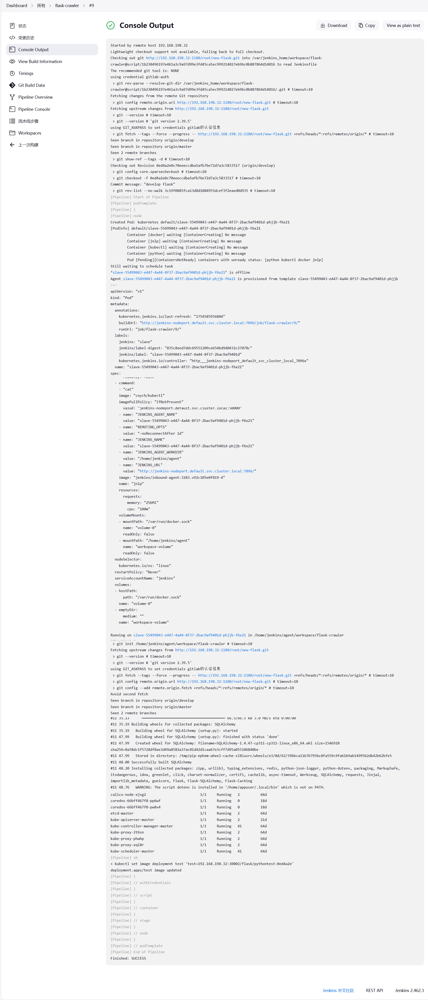

可以加入前面说的单元测试、SQ扫描等


### 第三部分：项目简历描述模板
项目名称：基于K8S构建cicd全自动流水线

项目描述：基于k8s部署gitlab+jenkins+harbor的全自动流水线，配置gitlab webhook和jenkins触发器，由开发机提交代码至gitlab时可一键触发jenkins全流程流水线构建(代码单元测试->代码编译打包->构建docker镜像并推送harbor镜像仓库->测试环境或线上环境自动拉取项目镜像并运行)

项目特点：jenkins采用了动态主从架构(master、slave pod)的部署方式，不用不创、用完即删，既有高可用性又可节省资源；流水线构建代码拆分出jenkins，以Jenkinsfile的形式放入项目中，缓解jenkins的压力；构建时通过gitlab分支区分不同构建环境(线上或测试环境)，并添加交互式确认，构建时具备流水线回滚和发布前的确认功能，以及merge check(develop分支合并master分支时会自动校验测试环境全流水线是否执行成功)。并且做了构建一致性保障，镜像部署时加入digest，并打入k8s annotation中，实现构建可追溯。


面试问答

什么叫动态主从？

master为控制节点jenkins，构建不同项目时动态创建不同的jenkins slave pod，不用不创、用完即删，既有高可用性又可节省资源


流水线环境是怎么做的？

不同于全部集成于jenkins的方式，这边采用pipeline script from scm搭配Jenkinsfiles的形式，构建环境跟着代码走


构建唯一性保障是怎么做的？

镜像以完整commit SHA作为tag，push后提取仓库返回的digest拼成tag@digest不可变引用进行部署，配合k8s annotation注解记录发布来源，保证构建产物与生产运行产物的一致性，实现发布可精确追溯、回滚可准确定位。


### 第四部分：课后作业
1、优化go项目流水线的发布流程

2、完成python爬虫项目的构建

3、扩展部分：单元测试、<font style="color:rgb(51,51,51);">SonarQube 扫描、冒烟测试</font>


