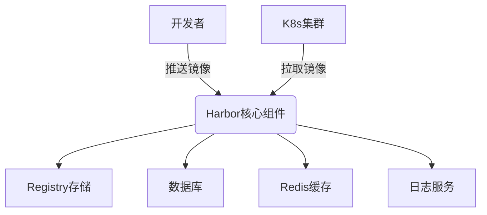
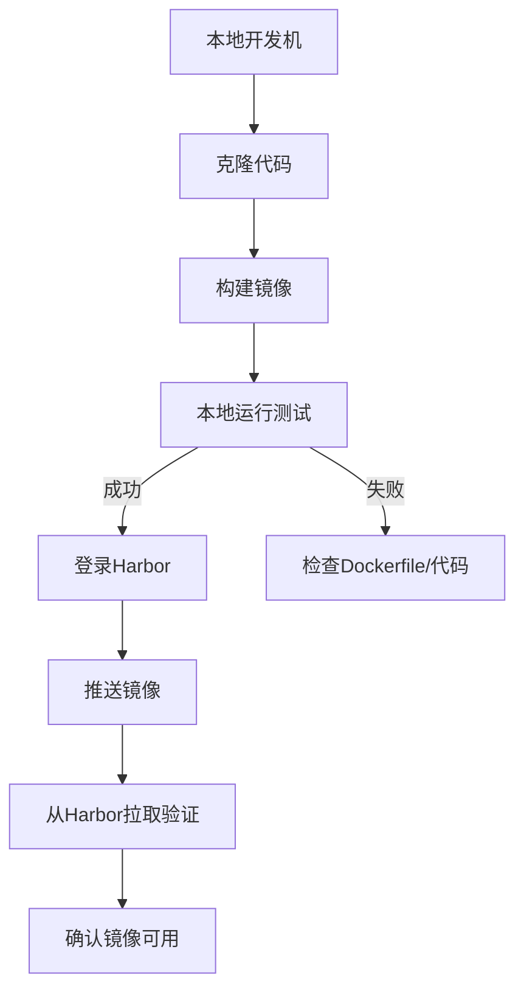

---
# 云原生实战第三课：Flask服务容器化与CI/CD流水线

## 课程目标
1. 掌握企业级容器镜像构建规范
2. 实现Harbor私有镜像仓库的部署与管理
3. 设计K8s生产级部署方案（配置分离、健康检查）
4. 构建Jenkins全自动CI/CD流水线
5. 实现GitLab代码变更自动触发部署

## 前置条件
- K8s集群（已部署Jenkins+GitLab）
- 新增服务器10.3.10.17用于Harbor
- GitLab仓库中已有Flask应用代码

---
# 前置Git学习

---

## 1. Git 简介与安装
### 1.1 什么是 Git？
Git 是一个**分布式版本控制系统**，由 Linus Torvalds 于 2005 年创建，用于跟踪文件修改历史、支持多人协作开发。核心功能包括：
- 版本回溯与历史追踪  
- 分支管理与并行开发  
- 代码合并与冲突解决  

### 1.2 安装 Git
| 操作系统 | 安装方法                               | 验证命令        |
| -------- | -------------------------------------- | --------------- |
| Windows  | [官网下载安装包](https://git-scm.com/) | `git --version` |
| macOS    | `brew install git`                     | `git --version` |
| Linux    | `sudo apt-get install git`             | `git --version` |

**git分支**

- master/main(**主分支**) 基线分支：怎么理解基线分支，我们所有的操作 以及新的需求都需要 以这个分支为基础 再创建新的分支 来做的 
- feature（需求分支，一般开发者都自己创建分支名：**feature/students_api**）： 就是基于master分支 新创建出来的，一般情况 我们一个需求 创建一个分支，然后如果这个需求搞完了 merge master(一般情况 是有代码评审的，因为master是跑在线上的)之后 就删掉了 
- bugfix 修bug 的临时分支：最终都是要合并到master内部的

### 1.3 基础配置

```bash
# 配置全局用户名和邮箱（提交时标识身份）
git config --global user.name "Your Name"
git config --global user.email "your@email.com"

# 查看所有配置项
git config --list
```

---

## 2. 基础命令与操作
### 2.1 仓库初始化与文件跟踪
```bash
# 初始化本地仓库
git init

# 查看仓库状态（显示未跟踪/已修改文件）
git status

# 添加文件到暂存区
git add filename      # 添加单个文件
git add .             # 添加所有文件

# 提交到本地仓库
git commit -m "提交说明"
```

### 2.2 查看与回退操作
```bash
# 查看提交历史（含哈希值、作者、时间）
git log

# 查看文件差异（工作区 vs 暂存区）
git diff

# 回退到上一版本
git reset --hard HEAD^
```

---

## 3. 分支管理
### 3.1 分支基础操作
```bash
# 创建新分支
git branch dev

# 切换分支
git checkout dev

# 创建并切换分支（推荐）
git checkout -b feature/login

# 合并分支到当前分支
git merge dev

# 删除分支
git branch -d dev
```

### 3.2 分支策略（团队协作）
- **主分支（main/master）**：仅用于发布稳定版本  
- **开发分支（develop）**：集成最新功能  
- **功能分支（feature/xxx）**：单任务开发，合并后删除  

---

## 4. 远程仓库操作
### 4.1 远程仓库交互
```bash
# 克隆远程仓库
git clone https://github.com/user/repo.git

# 关联本地与远程仓库
git remote add origin https://github.com/user/repo.git

# 推送本地分支到远程
git push origin main

# 拉取远程更新
git pull origin main
```

---

## 5. 冲突处理与解决
### 5.1 冲突的产生场景
- 多人修改同一文件的同一行代码  
- 合并分支时存在不兼容的修改  

### 5.2 解决冲突步骤
1. **定位冲突文件**  
   
   ```bash
   # 拉取代码时触发冲突
   git pull origin main
   ```
2. **手动编辑冲突文件**  
   
   ```text
   <<<<<<< HEAD
   本地修改内容
   =======
   远程修改内容
   >>>>>>> commit-hash
   ```
3. **选择保留内容**  
   
   - 删除冲突标记（`<<<<<<<`, `=======`, `>>>>>>>`）  
   - 调整代码逻辑  
   
4. **标记冲突已解决**  
   
   ```bash
   git add filename
   git commit -m "解决冲突"
   ```

### 5.3 快速保留策略
```bash
# 保留本地修改
git checkout --ours filename

# 保留远程修改
git checkout --theirs filename
```

---

## 6. 高级技巧与最佳实践
### 6.1 高级命令

[Bug分支 - Git教程 - 廖雪峰的官方网站](https://liaoxuefeng.com/books/git/branch/bug/index.html)

```bash
#存储命令
$ git stash
Saved working directory and index state WIP on dev: f52c633 add merge

# 选择性提交（应用特定提交到当前分支）
git cherry-pick commit-hash

# 标签管理（标记版本）
git tag v1.0.0
git push origin v1.0.0
```

### 6.2 避免冲突的实践
1. **频繁拉取远程更新**：每天开始工作前执行 `git pull`  
2. **小步提交**：单次提交仅包含一个功能或修复  
3. **使用 IDE 工具**：VSCode、IntelliJ 等可视化冲突解决界面  
4. **团队规范**：约定文件修改权限与代码审查流程  

## 7.现场练习

1. 在windows本地拉取远端仓库，并且基于main分支 创建自己的分支，调用已经写好的接口生成csv文件，并且将生成好的文件改名 合并到main分支
   ```bash
   curl -X POST http://127.0.0.1:5000/crawl/api/v1/crawl -H "Content-Type: application/json" -d '{"platform":"douban_book","type":"books"}'
   
   ```

   

---

> 参考文档：[Git 官方文档](https://git-scm.com/doc) | [廖雪峰 Git 教程](https://www.liaoxuefeng.com/wiki/896043488029600)


# 第一部分：Harbor私有仓库部署（30分钟）

### 1.1 Harbor架构解析


### 1.2 安装部署（在新服务器执行）
```bash
# 1. 安装Docker
curl -fsSL https://get.docker.com | bash -s docker

# 2. 下载Harbor离线包
wget https://github.com/goharbor/harbor/releases/download/v2.8.2/harbor-offline-installer-v2.8.2.tgz
tar xvf harbor-offline-installer-v2.8.2.tgz
cd harbor


cp harbor.yml.tmp harbor.yml
vim harbor.yml
hostname: 10.3.10.101                # 修改为本机IP

#https:                                 # 
#  # https port for harbor, default is 443
#  port: 443
#  # The path of cert and key files for nginx
#  certificate: /your/certificate/path
#  private_key: /your/private/key/path
harbor_admin_password: Harbor12345      # admin 密码


# 5. 执行安装
./install.sh 

# 6. 验证状态

docker-compose ps
```


### 1.3 集群配置

```bash

# 重启Docker
systemctl restart docker
```

---
# 第二部分：Flask服务容器化（30分钟）

### **操作流程图解**



### 

### **执行环境说明**
| 角色           | IP地址       | 用途说明                   | 访问方式                     |
| -------------- | ------------ | -------------------------- | ---------------------------- |
| K8s Master节点 | 10.3.213.100 | 集群管理节点               | SSH访问                      |
| K8s Node节点   | 10.3.213.101 | 工作节点（Jenkins/GitLab） | 通过NodePort 30077/30088访问 |
| Harbor私有仓库 | 10.3.10.101  | 镜像存储                   | HTTPS访问                    |
| NFS服务器      | 10.3.10.16   | 存储卷服务                 | SSH访问                      |
| 本地开发机     | Windows PC   | 代码开发/提交              | Git客户端操作                |

---

### **2.1 开发环境准备（本地Windows/或开发机器环境）**
```bash
# 1. 克隆仓库（使用Git Bash）
git clone http://10.3.213.101:30088/devops-cwj/flask-crawler.git
cd flask-crawler

# 2. 创建Dockerfile（路径：项目根目录）
# 使用VSCode等工具编辑，内容参考下方优化版
```

#### **优化版Dockerfile**

pre-image 

```dockerfile
# 第一阶段：构建依赖
FROM python:3.11-alpine AS builder

# 创建非root用户并设置目录权限
RUN addgroup -S appuser && adduser -S appuser -G appuser \
    && mkdir -p /home/appuser/.local \
    && chown -R appuser:appuser /home/appuser
    
# 切换到非特权用户（避免root用户运行容器）
USER appuser
WORKDIR /app
COPY requirements.lock .

# 安装Python依赖到用户目录
RUN pip install --user --no-cache-dir -r requirements.lock \
    -i https://pypi.tuna.tsinghua.edu.cn/simple

# 第二阶段：运行时
FROM python:3.11-alpine

RUN addgroup -S appuser && adduser -S appuser -G appuser \
    && mkdir -p /home/appuser/.local \
    && chown -R appuser:appuser /home/appuser

# 配置阿里云镜像源
RUN sed -i 's/dl-cdn.alpinelinux.org/mirrors.aliyun.com/g' /etc/apk/repositories \
    && apk update \
    && apk add --no-cache curl \
    && rm -rf /var/cache/apk/*

WORKDIR /app

# 复制依赖（确保路径一致）
COPY --from=builder --chown=appuser:appuser /home/appuser/.local /home/appuser/.local
COPY --chown=appuser:appuser . .

ENV PATH="/home/appuser/.local/bin:$PATH" \
    PYTHONPATH="/app" \
    GUNICORN_WORKERS=4

USER appuser
EXPOSE 5000

HEALTHCHECK --interval=30s --timeout=10s \
  CMD curl -fs http://localhost:5000/health || exit 1

CMD ["gunicorn", "-w", "4", "-b", "0.0.0.0:5000", "wsgi:app"]
```

---


**修改daemon配置文件/etc/docker/daemon.json来使用加速器**

```json
https://cr.console.aliyun.com/cn-hangzhou/instances/mirrors


{
  "insecure-registries": ["10.3.10.101:80"], 
  "registry-mirrors": [
    "https://v117q3rj.mirror.aliyuncs.com",
    "https://docker.1ms.run",
    "https://docker.xuanyuan.me"
  ]
}


sudo systemctl daemon-reload
sudo systemctl restart docker
```


调整requestments.txt

```

(.venv) [root@node4 flask-crawler]# cat requirements.txt
flask==2.2
flask-sqlalchemy==3.0.1
flask-caching==2.0.2
redis==4.5.5
python-dotenv==1.0.0

```

#### 使用虚拟环境锁定依赖

在构建镜像前，通过虚拟环境生成精确的依赖树：

```bash
python -m venv .venv
source .venv/bin/activate
pip install -r requirements.txt
pip freeze > requirements.lock


[root@node4 flask-crawler]# cat requirements.lock
async-timeout==5.0.1
cachelib==0.9.0
click==8.1.8
Flask==2.2.0
Flask-Caching==2.0.2
Flask-SQLAlchemy==3.0.3
greenlet==3.1.1
importlib_metadata==8.6.1
itsdangerous==2.2.0
Jinja2==3.1.6
MarkupSafe==3.0.2
python-dotenv==1.0.0
redis==4.5.5
SQLAlchemy==1.4.47
typing_extensions==4.12.2
Werkzeug==2.2.0
zipp==3.21.0
requests==2.31.0
python-json-logger==2.0.7
```

然后在Dockerfile中使用`requirements.lock`代替原文件：

```dockerfile
COPY requirements.lock .
RUN pip install --user -r requirements.lock
```


pip 使用镜像加速

```
在使用pip工具时，通过指定-i参数，以从特定镜像地址下载Python包

pip install pandas -i https://pypi.tuna.tsinghua.edu.cn/simple
```


```bash
# 清理构建缓存
docker builder prune -af
# 重新构建镜像
docker build -t 10.3.10.101:80/devops/flask-crawler:1.0 .


#查看构建
(.venv) [root@node4 flask-crawler]# docker images | grep '10.3.10.101'
10.3.10.101/devops-cwj/flask-crawler   1.0         c1346fa226ef   16 hours ago   281MB

# 测试容器启动
docker run -it --rm 10.3.10.101:80/devops/flask-crawler:1.0 sh
# 检查应用文件
(.venv) [root@node4 flask-crawler]# docker run -it --rm 10.3.10.101:80/devops/flask-crawler:1.0 sh
$ ls -l app
total 24
-rw-r--r--. 1 appuser appuser 1332 Mar 22 08:55 __init__.py
drwxr-xr-x. 1 appuser appuser  183 Mar 22 08:55 __pycache__
-rw-r--r--. 1 appuser appuser  412 Mar 22 08:55 auth.py
-rw-r--r--. 1 appuser appuser  818 Mar 22 08:55 config.py
-rw-r--r--. 1 appuser appuser  673 Mar 22 08:55 crawl.py
drwxr-xr-x. 1 appuser appuser  102 Mar 22 08:55 crawlers
-rw-r--r--. 1 appuser appuser  171 Mar 22 08:55 extensions.py
drwxr-xr-x. 1 appuser appuser   42 Mar 22 08:55 models
-rw-r--r--. 1 appuser appuser  782 Mar 22 08:55 routes.py
drwxr-xr-x. 1 appuser appuser   51 Mar 22 08:55 services
drwxr-xr-x. 1 appuser appuser   82 Mar 22 08:55 utils

```


---

**手动推送镜像至harbor**

```bash
(.venv) [root@node4 flask-crawler]# docker tag 10.3.10.101/devops-cwj/flask-crawler:1.0 10.3.10.101:80/devops/flask-crawler:1.0   #强制使用80端口

# 镜像名称必须严格遵循格式：[Harbor地址]/[项目名]/[镜像名]:[标签]
# 正确示例：10.3.10.101:80/devops/flask-crawler:1.0
(.venv) [root@node4 flask-crawler]# docker images
REPOSITORY                                TAG         IMAGE ID       CREATED        SIZE
10.3.10.101/devops-cwj/flask-crawler      1.0         c1346fa226ef   17 hours ago   281MB
10.3.10.101:80/devops-cwj/flask-crawler   1.0         c1346fa226ef   17 hours ago   281MB
10.3.10.101:80/devops/flask-crawler       1.0         c1346fa226ef   17 hours ago   281MB
python                                    3.11-slim   de3a6c124050   3 months ago   130MB
goharbor/harbor-exporter                  v2.11.1     cdf68efc001e   7 months ago   114MB
goharbor/redis-photon                     v2.11.1     acf90a312d47   7 months ago   170MB
goharbor/trivy-adapter-photon             v2.11.1     24a8273e807a   7 months ago   339MB
goharbor/harbor-registryctl               v2.11.1     43fca2a06374   7 months ago   168MB
goharbor/registry-photon                  v2.11.1     9da6663b36f2   7 months ago   90.3MB
goharbor/nginx-photon                     v2.11.1     193a1b77b7d4   7 months ago   159MB
goharbor/harbor-log                       v2.11.1     2752e033bfbb   7 months ago   169MB
goharbor/harbor-jobservice                v2.11.1     a8005a88b3dc   7 months ago   165MB
goharbor/harbor-core                      v2.11.1     eaf65baad3f6   7 months ago   191MB
goharbor/harbor-portal                    v2.11.1     f58813018a49   7 months ago   167MB
goharbor/harbor-db                        v2.11.1     be56f8030c48   7 months ago   277MB
goharbor/prepare                          v2.11.1     1d00ffdb2e67   7 months ago   216MB
(.venv) [root@node4 flask-crawler]# docker push 10.3.10.101:80/devops/flask-crawler:1.0
The push refers to repository [10.3.10.101:80/devops/flask-crawler]
cb2bd5bbb092: Pushed
363c380c3e99: Pushed
839298d77caf: Pushed
7d365c232164: Pushed
e8e8d23f360c: Pushed
e394b4c0757a: Pushed
97d879c3dfa3: Pushed
e2f88fe30c9c: Pushed
1287fbecdfcc: Pushed
1.0: digest: sha256:b1ed303ac576124e1cf7cb395510309f99d94a0139c06099ed8b52fe5813cc7c size: 2422

```


**调整flask代码并且提交到远端库**


验证镜像内服务是否启动

```bash

/app $ nohup python wsgi.py --host=0.0.0.0 --port=5000  2>&1 &
/app $ nohup: appending output to /home/appuser/nohup.out

/app $
/app $
/app $ netstat -tuln | grep 5000
tcp        0      0 127.0.0.1:5000          0.0.0.0:*               LISTEN
/app $  curl -v -X GET http://127.0.0.1:5000/users

```


---

#### **推送镜像到 Harbor**
1. **登录 Harbor**：
   
   ```bash
   docker login 10.3.10.101 -u admin -p Harbor12345
   # 成功提示：Login Succeeded
   ```
   
2. **推送镜像**：
   ```bash
   docker push 10.3.10.101:80/devops/flask-crawler:1.7
   ```

3. **验证推送结果**：
   
   - 浏览器访问 `http://10.3.10.101`（或配置的域名）
   - 进入 `devops-cwj` 项目 → 查看 `flask-crawler` 镜像是否存在

---

#### **从 Harbor 拉取镜像验证**
```bash
# 删除本地镜像（可选）
docker rmi 10.3.10.101:80/devops/flask-crawler:1.7

# 从 Harbor 拉取镜像
docker pull 10.3.10.101:80/devops/flask-crawler:1.7

# 再次运行测试
[root@node4 ~]# docker run -it --rm 10.3.10.101:80/devops/flask-crawler:1.7 sh

```

---

### **常用命令速查**
```bash
# 查看本地镜像
docker images | grep flask-crawler

# 强制删除镜像
docker rmi -f 10.3.10.101/devops-cwj/flask-crawler:1.0

# 清理无效镜像
docker image prune -a
```

---

### 现场/课后 作业

1. 在仓库内每个人新建自己的分支， 按照上一节课的作业 weibo接口调用成功后，手动再开发机上（ 10.3.10.101）在自己的分支，编写requeriments.txt dockerfile 来构建自己的服务镜像，并且成功运行，后在harbor创建自己的项目 把已经验证没问题的镜像推上去；

