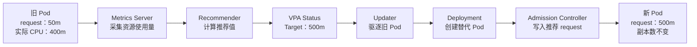
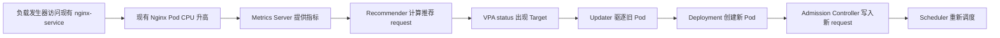

# Kubernetes VPA 

## 一、什么是 VPA

VPA（Vertical Pod Autoscaler，垂直 Pod 自动扩缩容）是 Kubernetes 的资源调整组件。它会根据 Pod 实际使用的 CPU、内存数据，为容器计算更合适的 `requests`，避免资源申请过小导致运行不稳定，或者申请过大造成浪费。

VPA主要由三个组件组成：

- `Recommender`：分析历史和当前资源使用量，计算推荐值。
- `Updater`：判断现有 Pod 是否需要按照推荐值更新，并负责驱逐旧 Pod。
- `Admission Controller`：在新 Pod 创建时，把推荐的资源值写入 Pod。

VPA调整的是“每个 Pod 应该申请多少 CPU和内存”，不会改变 Pod 副本数量。实验使用的 VPA 1.0.0 通常通过重建 Pod 来应用新的资源配置。

下面以 CPU request 从 `50m` 调整到 `500m` 为例，展示 VPA的完整工作过程：



> 图中的数值只是示例。VPA根据实际采样数据计算结果，重点是它调整单个 Pod 的资源申请量，而不是增加 Pod 数量。

## 二、实验目标

本实验基于以下环境：

- Kubernetes `v1.29.2`
- 1 台 Master、2 台 Worker
- 集群中已有 LNMP 和 Redis；本实验直接使用现有 `default/nginx`，不再部署额外的 Web 应用
- VPA源码固定在 Git 提交 `9f87b78df0f1d6e142234bb32e8acbd71295585a`
  - 这串字符是一次 Git提交的唯一编号，相当于指定某个时刻的源码快照。执行 `git checkout` 后，所有学生都会使用完全相同的代码，避免主分支更新造成安装步骤或镜像版本不一致。
- 该源码快照中的安装脚本实际部署 VPA `1.0.0`。Git提交编号用于确定源码内容，`1.0.0` 才是 VPA版本号，两者不是同一个概念。

完成实验后，学生应能观察到：

1. Metrics Server 提供 Pod 的 CPU、内存指标。
2. VPA Recommender 根据持续负载生成新的 CPU request 推荐值。
3. `Off` 模式只推荐，不修改 Pod。
4. 切换到 `Auto` 后，Updater 逐个驱逐旧 Pod。
5. Admission Controller 给新 Pod 写入更高的 CPU request。
6. Nginx Pod 副本数保持不变，说明 VPA 是垂直扩缩容，不是水平扩缩容。

> 重要：VPA 没有“CPU 超过 80%就触发”这种固定水位。这里所说的“高水位”，是实际 CPU 长时间明显高于当前 request，促使 VPA 调高推荐值；Updater 再根据推荐值与当前 request 的差异决定是否驱逐 Pod。

可以把这句话拆成三步理解：

1. **VPA不直接判断百分比**：它不会配置一个“CPU使用率超过 80%就扩容”的条件。百分比阈值更像 HPA的工作方式。
2. **Recommender分析一段时间的实际用量**：例如 Pod 的 CPU request 是 `50m`，但 Metrics Server 持续采集到它实际使用约 `400m`，Recommender 可能把目标 request 推荐为 `500m`。这里的 `50m` 是调度时预留的 CPU，不代表程序最多只能使用 `50m`。
3. **Updater决定是否应用建议**：推荐值发生变化不代表马上重建。只有 VPA处于 `Auto` 或 `Recreate` 模式，并且推荐值与当前 request 的差异足够明显，同时满足副本数、PDB和资源容量等条件时，Updater 才会驱逐旧 Pod。新 Pod 创建时，再由 Admission Controller 写入新的 request。

因此，本实验中的“触发 VPA”实际表示：**持续高负载使推荐值升高，随后 Updater 判断需要更新并重建 Pod**，而不是 CPU刚超过某个百分比就立即执行。

## 三、工作流程



本实验先让 VPA 处于 `Off` 模式，确认推荐值已经产生，然后再切换为 `Auto`。这样可以把“计算建议”和“应用建议”两个阶段清楚地展示出来。

## 四、实验前准备

### 异常情况
1.  若出现Pod已分配到相应node上还出现pending的情况，可能是由于从快照恢复后状态不一致导致，重启master上的nfs-server与node上的kubelet即可。

### Metrics Server 部署
Kubernetes 1.29应使用 Metrics Server `0.7.x`。不要直接安装当前的 `latest`，因为较新的 Metrics Server 已不再支持 Kubernetes 1.29。这里固定使用 `v0.7.2`：

```bash
# 部署metrics-server
kubectl apply -f /root/resources/07.metrics-server.yaml
# 查看部署情况
kubectl -n kube-system rollout status deployment/metrics-server --timeout=180s
# 验证集群水位是否正常显示
kubectl top nodes
```

### 确认环境

以下命令均在 `master01` 上执行。
```bash

kubectl get nodes -o wide
# 查看hpa是否控制了lnmp应用，避免影响到vpa部署
kubectl get hpa -A
# 确认metrics-server已注册至k8s api
kubectl get apiservice v1beta1.metrics.k8s.io
kubectl top nodes
kubectl top pods -A
openssl version
```

要求：

- 3 个节点均为 `Ready`。
- `kubectl top` 能返回数据。
- 实验 Deployment 没有同时被基于 CPU 或内存的 HPA 控制。
- OpenSSL 版本不低于 `1.1.1`。
- Worker 节点能够拉取本实验所用镜像。


## 五、安装 VPA 1.0.0

### 1. 获取 VPA 源码

推荐从 GitHub 拉取固定提交。下面只检出本实验需要的 `vertical-pod-autoscaler` 目录：

```bash
cd /root/resources

git clone https://github.com/kubernetes/autoscaler.git

cd autoscaler

git checkout --detach \
  9f87b78df0f1d6e142234bb32e8acbd71295585a

cd vertical-pod-autoscaler
```

文件较大，如果访问 GitHub 较慢，可以使用夸克网盘：

> VPA 包夸克链接：<https://pan.quark.cn/s/0b4863f75203>
> scp  autoscaler-vpa-lab.zip root@10.3.204.100:/root/resource
> dnf install -y upzip
> upzip /root/resource/autoscaler-vpa-lab.zip

两种方式任选其一，最终都应存在以下目录：

```text
/root/resources/autoscaler-vpa-lab/vertical-pod-autoscaler
```

### 2. 执行安装

```bash
cd /root/resources/autoscaler-vpa-lab/vertical-pod-autoscaler
REGISTRY=m.daocloud.io/registry.k8s.io/autoscaling \
TAG=1.0.0 \
./hack/vpa-up.sh
```

该脚本会创建：

- `VerticalPodAutoscaler` 和 `VerticalPodAutoscalerCheckpoint` CRD
- VPA所需的 RBAC、ServiceAccount
- `vpa-recommender`
- `vpa-updater`
- `vpa-admission-controller`
- Webhook 的 Service、Secret 和证书


### 3. 验证安装

```bash
kubectl -n kube-system rollout status deployment/vpa-recommender 

kubectl -n kube-system rollout status deployment/vpa-updater

kubectl -n kube-system rollout status deployment/vpa-admission-controller
```

```bash
kubectl -n kube-system get pods -l 'app in (vpa-recommender,vpa-updater,vpa-admission-controller)'

kubectl get crd verticalpodautoscalers.autoscaling.k8s.io  verticalpodautoscalercheckpoints.autoscaling.k8s.io

kubectl get mutatingwebhookconfiguration vpa-webhook-config
kubectl -n kube-system get service,endpoints vpa-webhook
kubectl -n kube-system get secret vpa-tls-certs
```

## 六、准备现有 LNMP 的 Nginx

本实验直接使用集群中已有的 `default/nginx` Deployment 和 `nginx-service`。配套 YAML **不会创建第二套 Web 服务**；其中的 `load-generator` 只是访问现有 Nginx 的压测工具，初始副本数为 0。

先确认真实资源：

```bash
kubectl -n default get deployment nginx
kubectl -n default get service nginx-service
kubectl -n default get pods -l app=nginx -o wide

```

要求：

- `nginx` 至少有 2 个副本；本集群已有 3 个时无需调整。
- `nginx-service` 能正常访问这些 Pod。
- 不对 Redis、MySQL 等有状态服务启用本次自动更新实验。

先备份 Nginx Deployment 的原始配置，以便回滚：

```bash
kubectl -n default get deployment nginx -o yaml /root/nginx-before-vpa.yaml
```

为了让 VPA 调整前后的差异容易观察，把现有 Nginx 容器的初始 CPU request 设为 `10m`，CPU limit 设为 `32m`：

```bash
kubectl -n default set resources deployment/nginx \
  --containers='*' \
  --requests=cpu=10m,memory=32Mi \
  --limits=cpu=50m,memory=64Mi

kubectl -n default rollout status deployment/nginx
```


将配套的 `vpa-lab.yaml` 复制到 `master01`，然后创建 VPA 和负载发生器：

```bash
kubectl apply -f vpa-lab.yaml

kubectl -n default get vpa nginx-vpa
kubectl -n vpa-lab get deployment,pod -o wide
```

查看现有 Nginx Pod 的初始资源：

```bash
kubectl -n default get pods -l app=nginx -o custom-columns='NAME:.metadata.name,UID:.metadata.uid,NODE:.spec.nodeName,CPU_REQUEST:.spec.containers[0].resources.requests.cpu,CPU_LIMIT:.spec.containers[0].resources.limits.cpu'
```

此时应看到 `CPU_REQUEST=50m`、`CPU_LIMIT=500m`，Nginx 副本数与实验前一致，`nginx-vpa` 处于 `Off` 模式。`Off` 表示 VPA 会计算推荐值，但不会驱逐或修改 Pod。

## 七、给现有 Nginx 制造高 CPU 水位

将负载发生器从 0 扩为 8 个副本。它会通过集群 DNS 持续访问 `nginx-service.default.svc.cluster.local`：

```bash
kubectl -n vpa-lab scale deployment/load-generator --replicas=8

kubectl -n vpa-lab rollout status deployment/load-generator \
  --timeout=180s
```

等待约 30～90 秒后查看现有 Nginx 的实际用量：

```bash
kubectl -n default top pods -l app=nginx --containers
kubectl top nodes
```

预期 Nginx Pod 的 CPU 使用量会明显高于 `10m` request。如果 CPU 仍然较低，可以逐步把负载发生器增加到 12 个副本：

```bash
kubectl -n vpa-lab scale deployment/load-generator --replicas=12
```

不要盲目继续增加。每次扩容后都执行 `kubectl top nodes`，避免把两个 Worker 的 CPU 全部压满。紧急停止压力：

```bash
kubectl -n vpa-lab scale deployment/load-generator --replicas=0
```

## 八、观察 VPA 推荐值

VPA Recommender 默认约每分钟取一次指标。通常等待约 5 分钟能够看到较明显的推荐值，较慢环境可等待 10 分钟。

持续观察：

```bash
kubectl -n default get vpa nginx-vpa -w
```

出现 CPU 推荐值后按 `Ctrl+C`，再查看详细信息：

```bash
kubectl -n default describe vpa nginx-vpa
```

只输出关键字段：

```bash
kubectl -n default get vpa nginx-vpa \
  -o jsonpath='{range .status.recommendation.containerRecommendations[*]}{.containerName}{" target="}{.target.cpu}{" lower="}{.lowerBound.cpu}{" upper="}{.upperBound.cpu}{" uncapped="}{.uncappedTarget.cpu}{"\n"}{end}'
```

字段含义：

- `target`：VPA 希望实际使用的 request。
- `lowerBound`：建议 request 不要低于该值。
- `upperBound`：建议 request 不要高于该值。
- `uncappedTarget`：未经过 `minAllowed`、`maxAllowed` 限制的原始建议。


## 九、接受 VPA 建议并观察 Pod requests 是否扩大

只有在 VPA 已经出现 `target.cpu` 后，才进行本步骤。VPA 没有单独的“接受本次建议”按钮；这里所说的接受建议，是把 `updateMode` 从 `Off` 改为 `Auto`，允许 Updater 应用推荐值。

先记录旧 Pod 的 UID 和 CPU request，后面用于对比：

```bash
kubectl -n default get pods -l app=nginx \
  -o custom-columns='NAME:.metadata.name,UID:.metadata.uid,CPU_REQUEST:.spec.containers[0].resources.requests.cpu'
```

此时 `CPU_REQUEST` 应为初始值 `50m`。在本实验使用的 VPA 1.0.0 中，`Auto` 实际等同于 `Recreate`：它不会在线修改正在运行的 Pod，而是驱逐旧 Pod，再由 Deployment 创建新 Pod。

### 终端一：观察 Nginx Pod

```bash
kubectl -n default get pods -l app=nginx -w
```

### 终端二：接受建议，将 VPA 切换为 Auto

```bash
kubectl -n default patch vpa nginx-vpa \
  --type=merge \
  -p '{"spec":{"updatePolicy":{"updateMode":"Auto"}}}'
```

Updater 默认约每分钟检查一次，不保证切换后立即重建。通常在数分钟内可以看到：

1. 旧 Nginx Pod 进入 `Terminating`。
2. Deployment 创建替代 Pod。
3. 新 Pod 创建时，Admission Controller 写入 VPA 推荐的 request。
4. Pod 名称和 UID 发生变化，但副本数保持不变。

查看事件和 Updater 日志：

```bash
kubectl -n default get events --sort-by=.metadata.creationTimestamp
kubectl -n kube-system logs deployment/vpa-updater --since=10m
```

Pod 重建后，再次查看 UID 和 request：

```bash
kubectl -n default get pods -l app=nginx -o custom-columns='NAME:.metadata.name,UID:.metadata.uid,NODE:.spec.nodeName,CPU_REQUEST:.spec.containers[0].resources.requests.cpu,CPU_LIMIT:.spec.containers[0].resources.limits.cpu'
```

对比切换前后的输出，预期可以看到：

- Pod 的名称和 UID 已发生变化，说明旧 Pod 被替换。
- 新 Pod 的 `CPU_REQUEST` 高于原来的 `50m`，并接近 VPA 的 `target.cpu`。
- `CPU_LIMIT` 仍为 `500m`，因为本实验配置的是 `controlledValues: RequestsOnly`，VPA 只修改 request。

具体推荐值会随机器性能和采样数据变化，不要求与教材示例完全一致。如果新 Pod 的 request 暂时没有变化，等待 Updater 下一轮检查后再观察事件和日志。

### 为什么 Deployment 里仍然是 10m

```bash
kubectl -n default get deployment nginx \
  -o jsonpath='{.spec.template.spec.containers[0].resources.requests.cpu}{"\n"}'
```

仍可能得到 `10m`。这是正常现象：VPA 1.0.0 的 Admission Controller 在新 Pod 创建时修改 Pod 对象，不会回写 Deployment 模板，应以新 Pod 的 request 为准。

### 为什么 RESTARTS 没有增加

Updater 删除的是整个旧 Pod，Deployment 创建的是新 Pod。它不是在原 Pod 内重启容器，因此新 Pod 的 `RESTARTS` 通常仍为 0。应观察 Pod 名称、UID 和创建时间是否变化。

## 十、停止实验、删除 VPA 并恢复 Nginx

先停止负载并关闭自动更新：

```bash
kubectl -n vpa-lab scale deployment/load-generator --replicas=0

kubectl -n default patch vpa nginx-vpa \
  --type=merge \
  -p '{"spec":{"updatePolicy":{"updateMode":"Off"}}}'
```

删除本次实验创建的 VPA 和负载发生器。下面的命令不会删除现有 `nginx`、`nginx-service`、PHP、MySQL 或 Redis：

```bash
kubectl -n default delete vpa nginx-vpa
kubectl delete namespace vpa-lab
```

恢复实验前保存的 Nginx Deployment 配置：

```bash
kubectl apply -f /root/nginx-before-vpa.yaml
kubectl -n default rollout status deployment/nginx --timeout=180s
```

如果整个集群都不再需要 VPA，才执行：

```bash
cd /root/autoscaler-vpa-lab/vertical-pod-autoscaler
./hack/vpa-down.sh
```

`vpa-down.sh` 会删除集群级 VPA 组件和 CRD，不要把它当作普通实验清理命令。

## 十一、常见问题排查

### 1. VPA一直没有推荐值

```bash
kubectl top pods -A
kubectl -n kube-system logs deployment/vpa-recommender --since=10m
kubectl -n default describe vpa nginx-vpa
```

重点检查 Metrics Server、VPA与目标 Deployment 是否同一命名空间，以及 `targetRef.name` 是否正确。

### 2. 有推荐值，但 Pod 不重建

依次检查：

```bash
kubectl -n default get vpa nginx-vpa \
  -o jsonpath='{.spec.updatePolicy.updateMode}{"\n"}'

kubectl -n default get deployment nginx
kubectl -n default get pdb
kubectl -n kube-system logs deployment/vpa-updater --since=10m
```

常见原因是仍处于 `Off`、副本不足、PDB 阻止驱逐、推荐值差异还不够大，或者 Updater 尚未进入下一轮检查。

### 3. Pod 重建了，但 request 没变化

```bash
kubectl -n kube-system get pods -l app=vpa-admission-controller
kubectl get mutatingwebhookconfiguration vpa-webhook-config
kubectl -n kube-system get service,endpoints vpa-webhook
kubectl -n kube-system logs deployment/vpa-admission-controller --since=10m
```

重点检查 Admission Controller、Webhook、Service端点和证书。

### 4. 新 Pod 一直 Pending

```bash
kubectl -n default describe pod <Nginx Pod名称>
kubectl describe nodes
```

这通常表示 VPA推荐的 request 超过节点剩余资源。本实验把 CPU `maxAllowed` 限制为 `500m`，就是为了降低该风险。

### 5. 停止压力后推荐值没有立即下降

这是正常的。VPA基于一段时间的历史数据计算推荐值，不会像 HPA 那样在负载下降后马上缩容。
