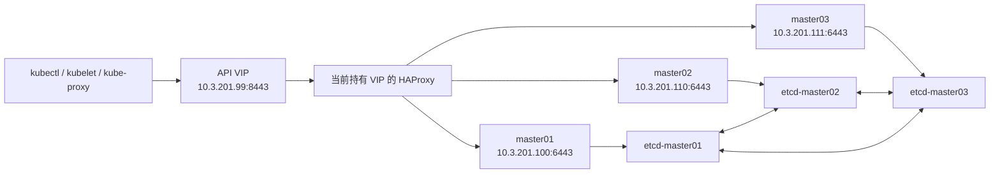

# Master三节点高可用

## 一、实验目标

当前已经存在一套可用集群：

```text
master01 + node01 + node02
```

本实验不重新初始化集群，而是在保留现有 Node、Pod、Service、PVC 和业务数据的前提下，
新增 `master02`、`master03`，最终形成：

```text
master01 + master02 + master03 + node01 + node02
```

实验完成后将实现：

1. 使用 Keepalived 提供可在三台 Master 之间漂移的 API VIP。
2. 使用 HAProxy 将 API 请求分发给三个健康的 kube-apiserver。
3. 使用 kubeadm 将两个新 Master 依次加入现有集群。
4. 将单成员 etcd 扩展为三成员 etcd。
5. 将原有 Master、Worker 和 kube-proxy 的 API 地址切换到 VIP。
6. 保留原有业务 Pod、Service、PVC、Calico 和数据。

本实验明确不会执行：

- 不在 `master01` 重新执行 `kubeadm init`。
- 不在 `master01`、`node01`、`node02` 执行 `kubeadm reset`。
- `node01`、`node02` 不删除 Node，也不重新 Join。
- 不重新安装 Calico。
- 不修改现有 Pod CIDR、Service CIDR 和 NFS 地址。

这里的“原地扩展”表示 Kubernetes 对象和业务数据不重建。重新签发并加载
`master01` 的 apiserver 证书时，Kubernetes API 可能短暂中断几秒，但节点上已经运行的
业务容器不会因此停止。

---

## 二、重要说明与回退边界

### 1. 为什么原集群不能直接加入新 Master

当前集群最初只有一台 Master，创建时没有配置稳定的 `controlPlaneEndpoint`。因此
kubeadm 直接把 `master01` 的真实地址作为集群 API 地址：

```text
https://10.3.201.100:6443
```

`controlPlaneEndpoint` 可以理解为“整个集群统一使用的 API 入口”。它不属于某一台
Master，而应该是 Master 发生变化后仍然可以访问的 VIP 或负载均衡地址。

查看 kubeadm 保存的配置：

```bash
kubectl -n kube-system get cm kubeadm-config \
  -o jsonpath='{.data.ClusterConfiguration}' | \
  grep controlPlaneEndpoint
```

改造前通常没有输出，表示没有统一入口。再查看管理员 kubeconfig：

```bash
kubectl config view \
  --kubeconfig=/etc/kubernetes/admin.conf \
  --minify \
  -o jsonpath='{.clusters[0].cluster.server}'
echo
```

改造前预期显示：

```text
https://10.3.201.100:6443
```

还可以查看 master01 的 apiserver 自身地址：

```bash
grep -- '--advertise-address' \
  /etc/kubernetes/manifests/kube-apiserver.yaml
```

预期包含：

```text
--advertise-address=10.3.201.100
```

`advertiseAddress` 和 `controlPlaneEndpoint` 的含义不同：

| 配置 | 作用 |
|---|---|
| `advertiseAddress: 10.3.201.100` | master01 自己的真实地址 |
| `advertiseAddress: 10.3.201.110` | master02 自己的真实地址 |
| `advertiseAddress: 10.3.201.111` | master03 自己的真实地址 |
| `controlPlaneEndpoint: 10.3.201.99:8443` | 三个 Master 共用的稳定入口 |

如果现在直接执行 `kubeadm join --control-plane`，通常会报错：

```text
unable to add a new control plane instance to a cluster that doesn't have
a stable controlPlaneEndpoint address
```

本实验的处理方法是：先真实部署 VIP 和 HAProxy，再补充证书 SAN、
`controlPlaneEndpoint` 和 `cluster-info`，最后才加入新 Master。不能通过
`--skip-phases=preflight` 绕过检查。

> kubeadm 官方不支持将最初未设置 `controlPlaneEndpoint` 的单控制平面集群直接转换为
> HA。本课件是用于现有虚拟机快照环境的实验性改造流程。严格生产环境应在维护窗口操作，
> 或新建高可用集群后迁移业务。

### 2. 本实验如何回退

本实验不制作 etcd 快照，使用已经准备好的原集群虚拟机快照作为恢复点。

开始前应确认：

- `master01`、`node01`、`node02` 的快照来自同一个实验时间点。
- 快照包含原集群系统盘和需要恢复的数据盘。
- 新增的 `master02`、`master03` 不属于旧集群恢复集。

如果改造失败并决定整体恢复：

1. 先关闭 `master02`、`master03`。
2. 关闭当前仍在运行的原集群虚拟机。
3. 将 `master01`、`node01`、`node02` 一起恢复到原快照。
4. 不要只恢复 `master01`，同时让新的 etcd 成员继续运行。

---

## 三、目标架构

### 1. 地址规划

| 主机 | IP | 作用 |
|---|---|---|
| API VIP | `10.3.201.99` | Kubernetes API 统一入口 |
| master01 | `10.3.201.100` | 现有 Master、etcd、NFS、HAProxy、Keepalived |
| node01 | `10.3.201.101` | 现有 Worker |
| node02 | `10.3.201.102` | 现有 Worker |
| master02 | `10.3.201.110` | 新增 Master、etcd、HAProxy、Keepalived |
| master03 | `10.3.201.111` | 新增 Master、etcd、HAProxy、Keepalived |

`10.3.201.99` 只用于 Kubernetes API，不是 NFS VIP。现有 NFS 仍使用
`10.3.201.100`。

现有 Service 网段与节点网段存在历史重叠，本实验不修改网段；只需确认 VIP 没有被某个
Service 占用，下面的命令应无输出：

```bash
kubectl get svc -A -o wide | grep -wF '10.3.201.99' || true
```

### 2. 请求链路



三个 Master 都运行 HAProxy 和 Keepalived，但同一时间只有一台持有 VIP。请求先到达
VIP 所在 Master 的 HAProxy，再由 HAProxy 转发给任意一个健康的 apiserver。

### 3. Keepalived 和 HAProxy 的分工

| 组件 | 主要功能 | 不负责什么 |
|---|---|---|
| Keepalived | 通过 VRRP 发送心跳并选举 VIP 持有者，让 `10.3.201.99` 在三台 Master 之间漂移 | 不监听 API 端口，也不负载均衡请求 |
| HAProxy | 监听 `8443`，检查三个 apiserver，并将新连接负载均衡到各 Master 的 `6443` | 不负责创建或漂移 VIP |

VRRP 是 Keepalived 用于心跳和选举的协议。正常情况下，优先级最高的 master01 持有
VIP；如果它停止发送心跳，master02 或 master03 会接管 VIP。

HAProxy 使用轮询方式选择健康后端。例如：

```text
连接 1 → master01:6443
连接 2 → master02:6443
连接 3 → master03:6443
```

可以简单记成：

```text
Keepalived：保证 API 入口 IP 不会因为一台 Master 宕机而消失
HAProxy：保证请求只转发给健康的 apiserver，并分散连接压力
```

完整访问链路：

```text
客户端 → Keepalived 管理的 VIP:8443 → HAProxy → 健康的 apiserver:6443
```

如果 VIP 所在 Master 宕机，由 Keepalived 漂移 VIP；如果只是一个 apiserver 异常，
HAProxy 会把它移出后端列表。两者共同解决 Kubernetes API 入口的单点问题，但不会自动
解决 NFS、MySQL、Redis 等业务存储的高可用问题。

---

## 四、扩容前检查

### 1. 确认原集群正常

在 `master01` 执行：

```bash

kubectl get nodes
kubectl get pods -A
kubectl get --raw='/readyz'
```

确认三个现有节点为 `Ready`、主要 Pod 正常、`/readyz` 返回 `ok` 后再继续。

本实验不制作 etcd 快照，使用已经准备好的原集群虚拟机快照作为恢复点。如果需要整体
回退，应先关闭新增 Master，再将原来的三台虚拟机一起恢复到同一个快照时间点。

### 2. 准备两个新 Master

两个新master需要按照 https://github.com/Eagles-Lab/EaglesLab-Notes/blob/main/SRE/Kubernetes/手动安装手册.md 中的部分操作进行初始化。其中，以下操作无需执行：
```
不执行 kubeadm init
不执行 kubeadm reset
不单独安装 Calico
不复制 master01 整个 /etc/kubernetes
不使用 Worker 的 join 命令
```

`master02`、`master03` 应满足：

- hostname 分别为 `master02`、`master03`。
- IP 分别为 `10.3.201.110`、`10.3.201.111`。
- kubeadm、kubelet、kubectl 为 `v1.29.2`。
- Docker 和 cri-dockerd 正常。
- Swap 已关闭。
- 不包含旧集群的 `/etc/kubernetes` 和 `/var/lib/etcd` 数据。

简单检查：

```bash
hostnamectl --static
ip -br address
kubeadm version -o short
systemctl is-active docker
systemctl is-active cri-docker
swapon --show
```

五台机器统一配置 `/etc/hosts`：

```text
10.3.201.100 master01
10.3.201.101 node01
10.3.201.102 node02
10.3.201.110 master02
10.3.201.111 master03
```

确保三台 Master 之间的 `6443`、`8443`、`2379-2380`、`10250` 和 VRRP 协议 112
可以通信。

---

## 五、部署 HAProxy 和 Keepalived

### 1. 安装软件

在三台 Master 执行：

```bash
dnf install -y haproxy keepalived
setsebool -P haproxy_connect_any 1
```

### 2. 配置 HAProxy

三台 Master 的 `/etc/haproxy/haproxy.cfg` 使用相同配置：

```text
global
    log         127.0.0.1 local2
    chroot      /var/lib/haproxy
    pidfile     /var/run/haproxy.pid
    maxconn     4000
    user        haproxy
    group       haproxy
    daemon

defaults
    mode                    tcp
    log                     global
    option                  tcplog
    timeout connect         10s
    timeout client          24h
    timeout server          24h

frontend kubernetes-api
    bind *:8443
    default_backend kubernetes-api-backend

backend kubernetes-api-backend
    balance roundrobin
    option httpchk GET /readyz
    http-check expect status 200
    server master01 10.3.201.100:6443 check check-ssl verify none inter 2s fall 3 rise 2
    server master02 10.3.201.110:6443 check check-ssl verify none inter 2s fall 3 rise 2
    server master03 10.3.201.111:6443 check check-ssl verify none inter 2s fall 3 rise 2
```

启动 HAProxy：

```bash
haproxy -c -f /etc/haproxy/haproxy.cfg
systemctl enable --now haproxy
```

此时只有 master01 后端为健康状态，另外两个后端暂时 DOWN 属于正常现象。

### 3. 配置 Keepalived

先确认网卡名和掩码：

```bash
ip -br address
```

下例假设网卡为 `ens160`，地址前缀为 `/16`。现场不同时必须替换。

三台 Master 创建 `/etc/keepalived/check_k8s_api.sh`：

```bash
#!/bin/bash
curl -kfsS --max-time 2 https://127.0.0.1:8443/readyz >/dev/null
```

```bash
chmod 750 /etc/keepalived/check_k8s_api.sh
```

三台机器的 Keepalived 参数：

| 主机 | STATE | PRIORITY | 本机 IP | 对端 IP |
|---|---|---:|---|---|
| master01 | MASTER | 120 | `.100` | `.110`、`.111` |
| master02 | BACKUP | 110 | `.110` | `.100`、`.111` |
| master03 | BACKUP | 100 | `.111` | `.100`、`.110` |

创建 `/etc/keepalived/keepalived.conf`，按上表替换占位符：

```text
global_defs {
    router_id <本机主机名>
}

vrrp_script check_haproxy {
    script "/etc/keepalived/check_k8s_api.sh"
    interval 2
    weight -30
}

vrrp_instance VI_K8S_API {
    state <MASTER或BACKUP>
    interface ens160
    virtual_router_id 51
    priority <优先级>
    advert_int 1

    authentication {
        auth_type PASS
        auth_pass K8sHA123
    }

    unicast_src_ip <本机完整IP>
    unicast_peer {
        <对端完整IP1>
        <对端完整IP2>
    }

    virtual_ipaddress {
        10.3.201.99/16 dev ens160
    }

    track_script {
        check_haproxy
    }
}
```

启动 Keepalived：

```bash
keepalived --config-test -f /etc/keepalived/keepalived.conf
systemctl enable --now keepalived
```

检查 VIP，正常情况下由 master01 持有：

```bash
ip address show dev ens160 | grep 10.3.201.99
```

---

## 六、给原集群增加稳定入口

### 1. 创建 kubeadm 配置

在 `master01` 创建 `/root/kubeadm-retrofit.yaml`：

```yaml
apiVersion: kubeadm.k8s.io/v1beta3
kind: InitConfiguration
localAPIEndpoint:
  advertiseAddress: "10.3.201.100"
  bindPort: 6443
nodeRegistration:
  name: master01
  criSocket: unix:///var/run/cri-dockerd.sock
---
apiVersion: kubeadm.k8s.io/v1beta3
kind: ClusterConfiguration
certificatesDir: /etc/kubernetes/pki
clusterName: kubernetes
kubernetesVersion: v1.29.2
controlPlaneEndpoint: "10.3.201.99:8443"
imageRepository: registry.aliyuncs.com/google_containers
featureGates:
  EtcdLearnerMode: true
apiServer:
  timeoutForControlPlane: 4m0s
  certSANs:
    - "10.3.201.99"
    - "10.3.201.100"
  extraArgs:
    authorization-mode: Node,RBAC
controllerManager: {}
scheduler: {}
dns: {}
etcd:
  local:
    dataDir: /var/lib/etcd
networking:
  dnsDomain: cluster.local
  podSubnet: 10.244.0.0/16
  serviceSubnet: 10.10.0.0/12
```

这些网络参数必须与原集群保持一致。这里只是增加 VIP 和
`controlPlaneEndpoint`，不能顺便修改 Pod 或 Service 网段。

验证 YAML：

```bash
kubeadm config validate --config /root/kubeadm-retrofit.yaml
```

### 2. 重新生成 apiserver 证书

先查看并记录旧证书 SAN：

```bash
openssl x509 \
  -in /etc/kubernetes/pki/apiserver.crt \
  -noout -text | \
  grep -A2 'Subject Alternative Name'
```

如果旧证书还有其他仍在使用的自定义 SAN，应先把它们加入配置文件中的 `certSANs`。

先保存原证书：

```bash
mkdir -p /root/master-ha-backup

mv /etc/kubernetes/pki/apiserver.crt \
  /root/master-ha-backup/apiserver.crt

mv /etc/kubernetes/pki/apiserver.key \
  /root/master-ha-backup/apiserver.key
```

生成包含 VIP 的新证书：

```bash
kubeadm init phase certs apiserver \
  --config /root/kubeadm-retrofit.yaml
```

生成后再次查看 SAN：

```bash
openssl x509 \
  -in /etc/kubernetes/pki/apiserver.crt \
  -noout -text | \
  grep -A2 'Subject Alternative Name'
```

必须能看到 `10.3.201.99` 和 `10.3.201.100`。

停止旧 apiserver 容器，kubelet 会自动按静态 Pod 清单重新创建：

```bash
APISERVER_ID=$(crictl \
  --runtime-endpoint=unix:///var/run/cri-dockerd.sock \
  ps --name kube-apiserver -q | head -n1)

crictl \
  --runtime-endpoint=unix:///var/run/cri-dockerd.sock \
  stop "$APISERVER_ID"
```

等待片刻后检查：

```bash
curl -fsS --cacert /etc/kubernetes/pki/ca.crt \
  https://10.3.201.100:6443/livez

curl -fsS --cacert /etc/kubernetes/pki/ca.crt \
  https://10.3.201.99:8443/livez
```

两个地址都应返回 `ok`。如果证书生成失败，应立即把备份证书恢复到原目录。

### 3. 更新集群配置和发现地址

写入 `controlPlaneEndpoint`：

```bash
export KUBECONFIG=/etc/kubernetes/admin.conf

kubeadm init phase upload-config kubeadm \
  --config /root/kubeadm-retrofit.yaml
```

把 `admin.conf` 切换到 VIP：

```bash
kubectl config set-cluster kubernetes \
  --server=https://10.3.201.99:8443 \
  --kubeconfig=/etc/kubernetes/admin.conf

mkdir -p /root/.kube
cp -f /etc/kubernetes/admin.conf /root/.kube/config
```

更新新节点 Join 时使用的 `cluster-info`：

```bash
kubeadm init phase bootstrap-token \
  --config /root/kubeadm-retrofit.yaml
```

确认集群配置和发现地址已经更新，并且能够通过 VIP 访问 API：

```bash
kubectl -n kube-system get cm kubeadm-config \
  -o jsonpath='{.data.ClusterConfiguration}' | \
  grep controlPlaneEndpoint

kubectl -n kube-public get cm cluster-info \
  -o jsonpath='{.data.kubeconfig}' | \
  grep 'server:'

kubectl get nodes
```

---

## 七、加入 master02 和 master03

### 1. 生成 Join 信息

上传共享证书：

```bash
kubeadm init phase upload-certs \
  --upload-certs \
  --config /root/kubeadm-retrofit.yaml
```

记录最后输出的 `certificate-key`，然后生成基础 Join 命令：

```bash
kubeadm token create --print-join-command
```

如果 Join 暂时提示 `cluster-info ConfigMap does not yet contain a JWS signature`，等待
几秒再重试即可，不要手工伪造或删除 `cluster-info`。

### 2. 加入 master02

在 `master02` 执行：

```bash
kubeadm join 10.3.201.99:8443 \
  --token <TOKEN> \
  --discovery-token-ca-cert-hash sha256:<HASH> \
  --control-plane \
  --certificate-key <CERTIFICATE_KEY> \
  --apiserver-advertise-address 10.3.201.110 \
  --cri-socket unix:///var/run/cri-dockerd.sock
```

回到 `master01` 检查：

```bash
kubectl get nodes

kubectl exec -n kube-system etcd-master01 -- \
  etcdctl \
  --endpoints=https://127.0.0.1:2379 \
  --cacert=/etc/kubernetes/pki/etcd/ca.crt \
  --cert=/etc/kubernetes/pki/etcd/healthcheck-client.crt \
  --key=/etc/kubernetes/pki/etcd/healthcheck-client.key \
  member list -w table

kubectl exec -n kube-system etcd-master01 -- \
  etcdctl \
  --endpoints=https://127.0.0.1:2379 \
  --cacert=/etc/kubernetes/pki/etcd/ca.crt \
  --cert=/etc/kubernetes/pki/etcd/healthcheck-client.crt \
  --key=/etc/kubernetes/pki/etcd/healthcheck-client.key \
  endpoint health --cluster
```

确认 master02 为 `Ready`、所有 endpoint 都健康，并且 etcd 中 master02 的
`IS LEARNER` 已经是 `false` 后，再加入 master03。

### 3. 加入 master03

在 `master03` 执行：

```bash
kubeadm join 10.3.201.99:8443 \
  --token <TOKEN> \
  --discovery-token-ca-cert-hash sha256:<HASH> \
  --control-plane \
  --certificate-key <CERTIFICATE_KEY> \
  --apiserver-advertise-address 10.3.201.111 \
  --cri-socket unix:///var/run/cri-dockerd.sock
```

检查：

```bash
kubectl get nodes

kubectl exec -n kube-system etcd-master01 -- \
  etcdctl \
  --endpoints=https://127.0.0.1:2379 \
  --cacert=/etc/kubernetes/pki/etcd/ca.crt \
  --cert=/etc/kubernetes/pki/etcd/healthcheck-client.crt \
  --key=/etc/kubernetes/pki/etcd/healthcheck-client.key \
  endpoint status --cluster -w table
```

预期看到五个 Ready 节点和三个健康的 etcd endpoint。

---

## 八、将原有节点切换到 VIP

新增 Master 后，原有节点仍然连接 `10.3.201.100:6443`。现在逐步改成
`10.3.201.99:8443`。

### 1. 更新 master01

`admin.conf` 已在前面切换。这里只需要把 master01 的 kubelet 也切换到 VIP：

```bash
cp -a /etc/kubernetes/kubelet.conf \
  /etc/kubernetes/kubelet.conf.before-vip

kubectl config set-cluster kubernetes \
  --server=https://10.3.201.99:8443 \
  --kubeconfig=/etc/kubernetes/kubelet.conf

systemctl restart kubelet
```

controller-manager 和 scheduler 可以继续连接本机 apiserver；该 Master 故障时，另外两台
Master 上的副本会重新选举，因此主流程不需要修改这两个 kubeconfig。

### 2. 更新 node01、node02

分别在 `node01`、`node02` 执行：

```bash
cp -a /etc/kubernetes/kubelet.conf \
  /etc/kubernetes/kubelet.conf.before-vip

kubectl config set-cluster kubernetes \
  --server=https://10.3.201.99:8443 \
  --kubeconfig=/etc/kubernetes/kubelet.conf

systemctl restart kubelet
```

每改完一台，就在 Master 上确认它恢复为 Ready，再修改下一台：

```bash
kubectl get nodes
```

### 3. 更新 kube-proxy

编辑 ConfigMap：

```bash
kubectl -n kube-system edit cm kube-proxy
```

把 `kubeconfig.conf` 中的：

```text
server: https://10.3.201.100:6443
```

改为：

```text
server: https://10.3.201.99:8443
```

重建 kube-proxy：

```bash
kubectl -n kube-system rollout restart daemonset kube-proxy
kubectl -n kube-system rollout status daemonset kube-proxy
```

这些操作不会重建业务 Pod。

---

## 九、最终验证

```bash
kubectl get nodes -o wide

kubectl get pods -n kube-system -o wide | \
  grep -E 'kube-apiserver|kube-controller-manager|kube-scheduler|etcd'

kubectl get pods -A
kubectl get pvc -A

curl -fsS --cacert /etc/kubernetes/pki/ca.crt \
  https://10.3.201.99:8443/livez
```

预期结果：

- 五个节点都是 `Ready`。
- 三台 Master 各有一套 apiserver、controller-manager、scheduler 和 etcd。
- VIP `/livez` 返回 `ok`。
- 原有 Pod、Service、PVC 和业务数据仍然存在。
- Discuz、MySQL、Redis、Ingress 和 NFS 访问正常。

---

## 十、简单故障验证

### 1. 验证 VIP 漂移

在当前持有 VIP 的 Master 停止 HAProxy：

```bash
systemctl stop haproxy
```

Keepalived 会把 VIP 漂移到另一台 Master。验证 API 后恢复：

```bash
curl -fsS --cacert /etc/kubernetes/pki/ca.crt \
  https://10.3.201.99:8443/livez

systemctl start haproxy
```

### 2. 验证一个 Master 故障

关闭 `master02` 或 `master03`，再次执行：

```bash
kubectl get nodes
kubectl get --raw='/readyz'
```

三个 etcd 成员中仍有两个存活，集群保持多数派。测试完成后重新启动该 Master。

不要关闭 `master01` 做业务无损测试，因为当前 NFS 仍在 `master01` 上；控制面高可用
不等于 NFS 和业务存储也已经高可用。

---

## 十一、实验总结

```text
部署 Keepalived 和 HAProxy
        ↓
给 apiserver 证书增加 VIP SAN
        ↓
写入 controlPlaneEndpoint 和 cluster-info
        ↓
依次加入 master02、master03
        ↓
把原有节点和 kube-proxy 切换到 VIP
        ↓
验证节点、etcd、VIP 和原有业务
```

需要记住：

1. Keepalived 管理 VIP，HAProxy 管理 apiserver 负载均衡。
2. 每台 Master 使用自己的真实 IP，所有客户端统一使用 VIP。
3. 新 Master 必须一次加入一台，确认 etcd 正常后再加入下一台。
4. 原有 Worker 不需要 reset 或重新 Join。
5. 控制面高可用不代表 NFS、MySQL 等业务组件自动高可用。

