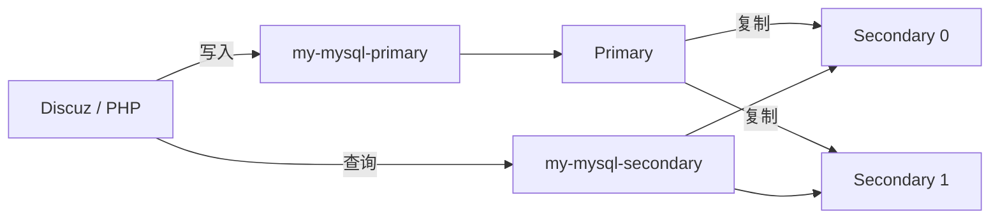
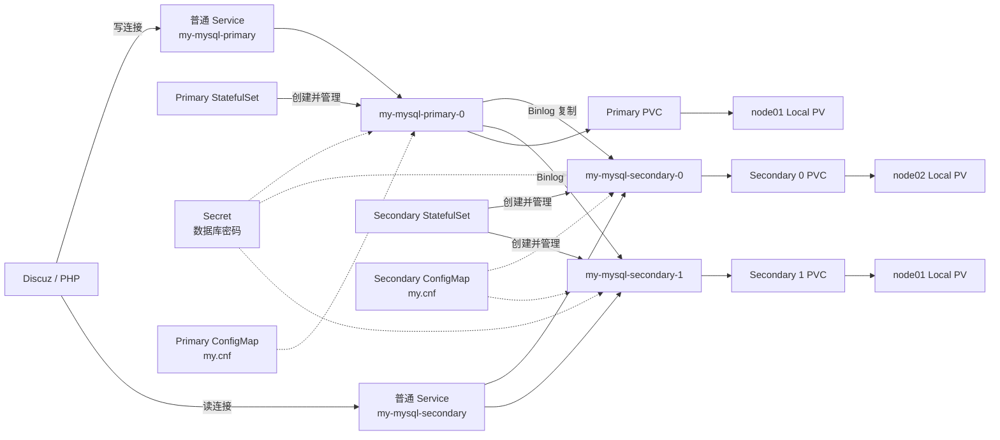
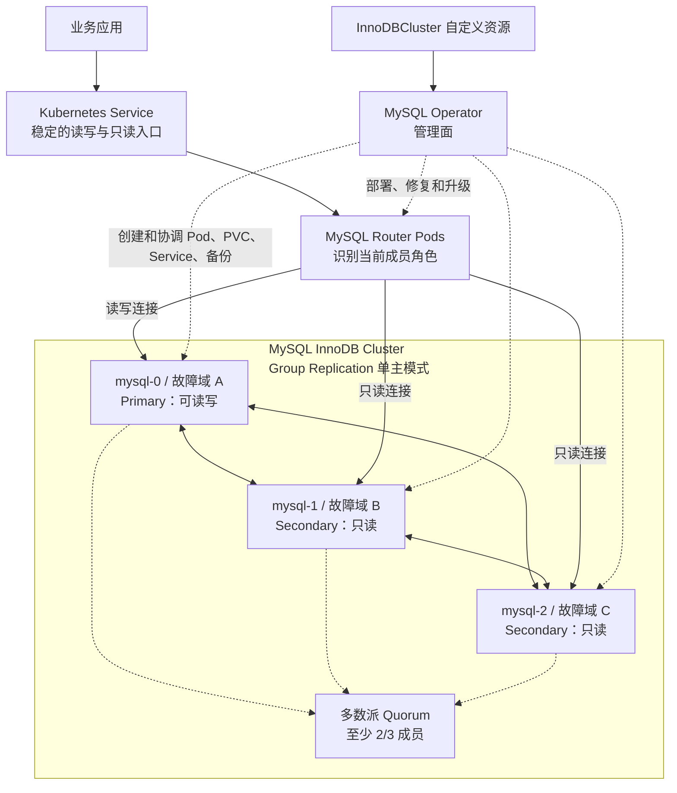

# Kubernetes MySQL 高可用

## 一、实验目标

本实验目标：

1. 部署 MySQL 一主两从并验证复制。
2. 把旧 MariaDB 的 `discuz` 数据导入新 MySQL。
3. 在切换业务前校验新旧数据。
4. 把 Discuz 切到新数据库并开启读写分离。

实验环境：

- 旧库：`mysql` Service，MariaDB 10.3
- 新主库：`my-mysql-primary` Service
- 新从库：`my-mysql-secondary` Service，后端有 2 个从库
- 业务库：`discuz`，291 张 InnoDB 表，约 16 MiB



---

## 二、模块一：部署并验证主从

### 1. 部署

#### 1.1 准备 Local PV 目录

数据库使用两个节点的本地目录：Primary 和 Secondary 1 固定在 `node01`，Secondary 0 固定在 `node02`。

登录 `node01` 执行：

```bash
mkdir -p \
  /data/mysql-ha/primary-0 \
  /data/mysql-ha/secondary-1

chown -R 1001:1001 \
  /data/mysql-ha/primary-0 \
  /data/mysql-ha/secondary-1

chmod 770 \
  /data/mysql-ha/primary-0 \
  /data/mysql-ha/secondary-1
```

登录 `node02` 执行：

```bash
mkdir -p /data/mysql-ha/secondary-0
chown -R 1001:1001 /data/mysql-ha/secondary-0
chmod 770 /data/mysql-ha/secondary-0
```

回到 `master01`，检查 Local PV 中的路径和节点绑定：

```bash
vim /root/resources/mysql-ha-local-pv.yaml
grep -nEA2 'path:|kubernetes.io/hostname|values:' /root/resources/mysql-ha-local-pv.yaml
```

预期 Primary PV 指向 `node01:/data/mysql-ha/primary-0`，Secondary 0 PV 指向 `node02:/data/mysql-ha/secondary-0`，Secondary 1 PV 指向 `node01:/data/mysql-ha/secondary-1`。

#### 1.2 部署 MySQL 集群

`mysql-cluster.yaml` 会创建密码、配置、访问入口以及一主两从 Pod，它们的关系如下：



确认 `mysql-cluster.yaml` 中的三个密码已经替换：

```bash
vim /root/resources/mysql-cluster.yaml
# 有输出表示密码还没替换，此时不能部署。
grep -n CHANGE_ME /root/resources/mysql-cluster.yaml
```

确认没有输出后再部署：

```bash
kubectl apply -f /root/resources/mysql-ha-local-pv.yaml
kubectl apply -f /root/resources/mysql-cluster.yaml

kubectl rollout status statefulset/my-mysql-primary --timeout=300s
kubectl rollout status statefulset/my-mysql-secondary --timeout=300s
```

检查：

```bash
kubectl get pods -l app.kubernetes.io/instance=my-mysql -o wide
kubectl get service my-mysql-primary my-mysql-secondary
kubectl get pvc
```

预期：1 个 Primary、2 个 Secondary，3 个 PVC 都是 `Bound`。Primary 和 Secondary 1 应运行在 `node01`，Secondary 0 应运行在 `node02`。

### 2. 检查复制状态

```bash
for POD in my-mysql-secondary-0 my-mysql-secondary-1; do
  echo "===== ${POD} ====="
  kubectl exec "${POD}" -- bash -ec \
    'mysql -uroot \
    -p"$(cat /opt/bitnami/mysql/secrets/mysql-root-password)" \
    -e "SHOW REPLICA STATUS\\G"' | \
  grep -E 'Source_Host|Replica_IO_Running|Replica_SQL_Running|Seconds_Behind_Source|Last_IO_Error|Last_SQL_Error'
done
```

正常结果：

```text
Replica_IO_Running: Yes
Replica_SQL_Running: Yes
Seconds_Behind_Source: 0
Last_IO_Error:
Last_SQL_Error:
```

### 3. 验证数据复制

在 Primary 写入一条数据：

```bash
kubectl exec my-mysql-primary-0 -- bash -ec '
  mysql -uroot \
  -p"$(cat /opt/bitnami/mysql/secrets/mysql-root-password)" \
  -e "
    CREATE DATABASE IF NOT EXISTS ha_test;
    CREATE TABLE IF NOT EXISTS ha_test.marker (
      id INT PRIMARY KEY,
      message VARCHAR(100)
    );
    REPLACE INTO ha_test.marker VALUES (1, \"from-primary\");
  "
'
```

在两个 Secondary 查询：

```bash
for POD in my-mysql-secondary-0 my-mysql-secondary-1; do
  kubectl exec "${POD}" -- bash -ec \
    'mysql -uroot \
    -p"$(cat /opt/bitnami/mysql/secrets/mysql-root-password)" \
    -e "SELECT @@hostname, message FROM ha_test.marker;"'
done
```

两个 Secondary 都出现 `from-primary`，模块一完成。

---

## 三、模块二：迁移旧数据库

### 1. 停止业务写入

```bash
kubectl delete hpa php-hpa --ignore-not-found
kubectl scale deployment/php --replicas=0
kubectl get pods -l app=php
```

确认没有 PHP Pod 后再导出。

### 2. 导出旧 MariaDB

```bash
mkdir -p /root/mysql-backup

kubectl exec deployment/mysql -- sh -ec '
  DUMP_BIN="$(command -v mariadb-dump || command -v mysqldump)"
  DB_PASSWORD="${MARIADB_ROOT_PASSWORD:-${MYSQL_ROOT_PASSWORD:-}}"

  exec "$DUMP_BIN" \
    -uroot -p"$DB_PASSWORD" \
    --databases discuz \
    --single-transaction \
    --quick \
    --routines \
    --events \
    --triggers \
    --hex-blob
' > /root/mysql-backup/discuz.sql

test -s /root/mysql-backup/discuz.sql && echo "备份成功"
```

### 3. 导入新 Primary

```bash
kubectl exec -i my-mysql-primary-0 -- bash -ec '
  exec mysql -uroot \
  -p"$(cat /opt/bitnami/mysql/secrets/mysql-root-password)"
' < /root/mysql-backup/discuz.sql
```

确认新库有 291 张表：

```bash
kubectl exec my-mysql-primary-0 -- bash -ec '
  mysql -N -uroot \
  -p"$(cat /opt/bitnami/mysql/secrets/mysql-root-password)" \
  -e "SELECT COUNT(*) FROM information_schema.TABLES
      WHERE TABLE_SCHEMA=\"discuz\"
        AND TABLE_TYPE=\"BASE TABLE\";"'
```

预期输出：`291`。

---

## 四、模块三：切换前校验数据

校验必须在恢复 PHP 之前完成，否则新库产生新帖子后，新旧结果自然不同。

### 1. 比较所有表的精确行数

在旧库执行：

```bash
kubectl exec -i deployment/mysql -- sh -ec '
  exec mysql -uroot -p123 --batch --raw --skip-column-names' < /root/resources/migration-check.sql > /root/mysql-backup/old-check.txt
```

在新 Primary 执行：

```bash
kubectl exec -i my-mysql-primary-0 -- bash -ec '
  exec mysql -uroot \
  -p"$(cat /opt/bitnami/mysql/secrets/mysql-root-password)" \
  --batch --raw --skip-column-names
' < /root/resources/migration-check.sql \
  > /root/mysql-backup/new-check.txt
```

数据库没有最终 `ORDER BY` 时，MariaDB 和 MySQL 可能以不同顺序返回相同结果。先按整行排序，再比较内容：

```bash
test -s /root/mysql-backup/old-check.txt
test -s /root/mysql-backup/new-check.txt

LC_ALL=C sort /root/mysql-backup/old-check.txt \
  > /root/mysql-backup/old-check.sorted.txt

LC_ALL=C sort /root/mysql-backup/new-check.txt \
  > /root/mysql-backup/new-check.sorted.txt

diff -u \
  /root/mysql-backup/old-check.sorted.txt \
  /root/mysql-backup/new-check.sorted.txt
```

没有输出，表示忽略行顺序后，数据库对象数量和每张表的精确行数一致。

> **扩展阅读：生产环境如何进一步校验数据**
>
> 本次实验只通过比较每张表的行数，对新旧数据库进行基础完整性校验。行数一致可以发现明显的缺行或多行，但不能证明每个字段的内容完全相同。
>
> 生产环境通常会按主键范围将大表分成多个小块，分别比较每个分块的行数和内容哈希。哈希一致，说明该分块的内容高度可信地一致；哈希不一致，则继续缩小主键范围，直到找到具体的差异记录。分块校验可以减少对数据库的一次性压力，也便于失败后重试。
>
> 无论使用行数还是分块哈希，新旧数据库都必须处于同一个业务时间点。因此，校验时需要停止业务写入，或在更大规模的迁移中配合 Binlog/CDC 追平增量数据。本实验数据量较小，不实际执行分块校验，掌握这个思路即可。

### 2. 检查两个 Secondary

```bash
for POD in my-mysql-secondary-0 my-mysql-secondary-1; do
  echo "===== ${POD} ====="
  kubectl exec "${POD}" -- bash -ec \
    'mysql -N -uroot \
    -p"$(cat /opt/bitnami/mysql/secrets/mysql-root-password)" \
    -e "SELECT COUNT(*) FROM information_schema.TABLES
        WHERE TABLE_SCHEMA=\"discuz\"
          AND TABLE_TYPE=\"BASE TABLE\";"'
done
```

两个 Secondary 都应输出 `291`，并且复制线程都是 `Yes`。

---

## 五、模块四：切换业务并开启读写分离

### 1. 创建业务账号

```bash
kubectl exec -it my-mysql-primary-0 -- bash -ec '
  mysql -uroot \
  -p"$(cat /opt/bitnami/mysql/secrets/mysql-root-password)"
'
```

```sql
CREATE USER IF NOT EXISTS 'discuz_app'@'%'
IDENTIFIED BY 'Discuz@2026';

GRANT ALL PRIVILEGES ON discuz.*
TO 'discuz_app'@'%';

exit
```

### 2. 先切到新 Primary

备份配置：

```bash
cp -a /root/data/nfs/html/config/config_global.php /root/data/nfs/html/config/config_global.php.bak

cp -a /root/data/nfs/html/config/config_ucenter.php /root/data/nfs/html/config/config_ucenter.php.bak

cp -a /root/data/nfs/html/uc_server/data/config.inc.php /root/data/nfs/html/uc_server/data/config.inc.php.bak

```

编辑 `config_global.php`：

```bash
vim /root/data/nfs/html/config/config_global.php
```

修改：

```php
$_config['db'][1]['dbhost'] = 'my-mysql-primary';
$_config['db'][1]['dbuser'] = 'discuz_app';
$_config['db'][1]['dbpw'] = 'Discuz@2026';
$_config['db'][1]['dbname'] = 'discuz';
```

原来的 `dbcharset`、`pconnect`、`tablepre` 不修改。

编辑 `config_ucenter.php`：

```bash
vi /root/data/nfs/html/config/config_ucenter.php
```

```php
define('UC_DBHOST', 'my-mysql-primary');
define('UC_DBUSER', 'discuz_app');
define('UC_DBPW', 'Discuz@2026');
define('UC_DBNAME', 'discuz');
```

编辑 `/root/data/nfs/html/uc_server/data/config.inc.php`，其中也要同时修改四项：

```php
define('UC_DBHOST', 'my-mysql-primary');
define('UC_DBUSER', 'discuz_app');
define('UC_DBPW', 'Discuz@2026');
define('UC_DBNAME', 'discuz');
```

恢复 PHP：

```bash
kubectl scale deployment/php --replicas=3
kubectl rollout status deployment/php --timeout=180s
```

测试：首页、登录、发帖、回复、修改资料。全部成功说明新 Primary 可用。

### 3. 开启从库读取

在 `config_global.php` 中增加：

```php
$_config['db'][1]['slave'][1]['dbhost'] = 'my-mysql-secondary';
$_config['db'][1]['slave'][1]['dbuser'] = 'discuz_app';
$_config['db'][1]['slave'][1]['dbpw'] = 'Discuz@2026';
$_config['db'][1]['slave'][1]['dbcharset'] = 'utf8';
$_config['db'][1]['slave'][1]['pconnect'] = 0;
$_config['db'][1]['slave'][1]['dbname'] = 'discuz';
$_config['db'][1]['slave'][1]['tablepre'] = 'pre_';
$_config['db'][1]['slave'][1]['weight'] = 0;

$_config['db']['common']['slave_except_table'] = 'common_session,common_member';
$_config['db']['slave'] = false;
```

`dbcharset` 和 `tablepre` 必须与原配置一致。

启用从库读取前，确认 `discuz_app` 已经复制到两个 Secondary，并能读取相同的用户数量：

```bash
for POD in my-mysql-secondary-0 my-mysql-secondary-1; do
  kubectl exec "${POD}" -- \
    mysql -udiscuz_app -p'Discuz@2026' \
    -e 'SELECT @@hostname, COUNT(*) AS members FROM discuz.pre_common_member;'
done
```

两个 Secondary 都应连接成功并返回相同的 `members`。同时重新执行模块一的复制状态检查，确认每个 Secondary 的两个复制线程都是 `Yes`、延迟为 0、错误为空，然后再开启从库读取：

```php
$_config['db']['slave'] = true;
```

### 4. 验证读写流向

临时开启三个 MySQL 实例的通用查询日志，并清空旧记录：

```bash
for POD in \
  my-mysql-primary-0 \
  my-mysql-secondary-0 \
  my-mysql-secondary-1; do
  kubectl exec "${POD}" -c mysql -- bash -ec '
    mysql -uroot \
    -p"$(cat /opt/bitnami/mysql/secrets/mysql-root-password)" \
    -e "
      SET GLOBAL general_log=OFF;
      SET GLOBAL log_output=\"TABLE\";
      TRUNCATE TABLE mysql.general_log;
      SET GLOBAL general_log=ON;
    "
  '
done
```

在 Discuz 中发布一个标题为 `rw-test` 的测试帖，然后多刷新几次首页和帖子列表。

查看 Primary 收到的业务写操作：

```bash
kubectl exec my-mysql-primary-0 -c mysql -- bash -ec '
  mysql -uroot \
  -p"$(cat /opt/bitnami/mysql/secrets/mysql-root-password)" \
  -e "
    SELECT event_time, LEFT(argument,160) AS sql_text
    FROM mysql.general_log
    WHERE user_host LIKE \"discuz_app%\"
      AND UPPER(LTRIM(argument))
          REGEXP \"^(INSERT|UPDATE|DELETE|REPLACE)\"
    ORDER BY event_time DESC
    LIMIT 10;
  "
'
```

预期能看到 `discuz_app` 执行的 `INSERT` 或 `UPDATE` 等语句，说明写操作进入 Primary。

再查看两个 Secondary 收到的业务查询：

```bash
for POD in my-mysql-secondary-0 my-mysql-secondary-1; do
  echo "===== ${POD} ====="
  kubectl exec "${POD}" -c mysql -- bash -ec '
    mysql -uroot \
    -p"$(cat /opt/bitnami/mysql/secrets/mysql-root-password)" \
    -e "
      SELECT event_time, LEFT(argument,160) AS sql_text
      FROM mysql.general_log
      WHERE user_host LIKE \"discuz_app%\"
        AND UPPER(LTRIM(argument)) LIKE \"SELECT%\"
      ORDER BY event_time DESC
      LIMIT 5;

      SELECT COUNT(*) AS app_writes_on_secondary
      FROM mysql.general_log
      WHERE user_host LIKE \"discuz_app%\"
        AND UPPER(LTRIM(argument))
            REGEXP \"^(INSERT|UPDATE|DELETE|REPLACE)\";
    "
  '
done
```

至少一个 Secondary 应出现 `discuz_app` 的 `SELECT` 语句，说明普通查询已经使用从库；两个 Secondary 的 `app_writes_on_secondary` 都应为 `0`，说明应用没有直接向从库发送写语句。Secondary Service 会按连接分发流量，因此不保证两个 Secondary 在一次测试中都有查询记录。由于 Discuz 的排除表和 UCenter 仍然可以访问 Primary，Primary 上出现部分 `SELECT` 也属正常现象。

验证完成后立即关闭通用查询日志并清理记录：

```bash
for POD in \
  my-mysql-primary-0 \
  my-mysql-secondary-0 \
  my-mysql-secondary-1; do
  kubectl exec "${POD}" -c mysql -- bash -ec '
    mysql -uroot \
    -p"$(cat /opt/bitnami/mysql/secrets/mysql-root-password)" \
    -e "
      SET GLOBAL general_log=OFF;
      TRUNCATE TABLE mysql.general_log;
    "
  '
done
```

`general_log` 会记录大量 SQL 并增加数据库开销，只应在实验验证期间短暂开启。

### 5. 实验验收

| 检查项目 | 结果 |
|---|---|
| Primary、两个 Secondary 正常 | 通过 / 失败 |
| 新旧数据库精确行数一致 | 通过 / 失败 |
| 首页和登录正常 | 通过 / 失败 |
| 发帖、回复正常 | 通过 / 失败 |
| 修改资料正常 | 通过 / 失败 |
| 写入 Primary、查询 Secondary | 通过 / 失败 |
| 主从复制线程正常 | 通过 / 失败 |

---

## 六、扩展思考

下面两项用于说明生产环境中的演进思路，不安排课堂操作。

### 1. 无损迁移与近零停机

本实验采用“停止写入后再导出、导入”的方式。这种方案简单可靠，可以保证停写窗口内不丢失业务数据，但数据量越大，业务停机时间越长。

需要接近零停机时，可先在旧库继续提供服务的同时完成全量迁移，再利用 Binlog/CDC 持续同步后续的 `INSERT`、`UPDATE` 和 `DELETE`。只在最后切换时短暂停止写入，追平剩余增量并完成最终校验。


新库尚未接受业务写入时，可以恢复旧配置快速回滚。新库已经产生新数据后，不能直接切回旧库，否则会丢失切换后的写入；必须先停写并将这部分增量数据同步回去。

### 2. 读扩容与自动故障转移

增加 Secondary 解决的是“读取压力大”：普通查询可以分散到更多从库。它不会提升 Primary 的写入能力，并且异步复制可能存在延迟，因此写入后立即读取等强一致场景仍应访问 Primary。

新增 Secondary 也不是简单地修改副本数：还要为它准备存储，导入完整历史数据，等待 Binlog 追平，并在复制健康后才能加入读取流量。

自动故障转移解决的是“Primary 故障后如何恢复写服务”。仅有多个 Secondary 不会自动实现高可用，还需要健康检查、选主、隔离旧 Primary、提升新 Primary 以及切换写入口。其中“隔离旧 Primary”很重要，可以防止两个节点同时写入而形成脑裂。


当前实验只实现了异步主从复制和读扩容，没有自动选主和写入故障转移。生产环境可继续引入 MySQL InnoDB Cluster、MySQL Router 和 MySQL Operator，完成集群成员管理、路由切换、备份及升级等生命周期管理。如果需要根据监控指标自动增减容，还需要额外的监控与自动化策略，不是单纯安装 Operator 就会自动完成。

#### 引入 InnoDB Cluster 后的架构

以下使用 InnoDB Cluster 默认的单主模式。生产环境应将 3 个 MySQL 成员分散到 3 个独立 Worker 或故障域，并为每个成员提供独立存储。当前课堂环境只有两个 Worker，因此只适合理解机制，不等同于完整的生产故障域。



这三个组件的职责不同：

- **Group Replication** 负责复制、多数派仲裁和 Primary 选举；选主不是 Operator 完成的。
- **MySQL Router** 根据集群元数据，把新的读写连接转发到当前 Primary，把只读连接转发到 Secondary。
- **MySQL Operator** 负责 Kubernetes 中的部署、修复、备份和升级等管理工作，不经过业务 SQL 流量，也不参与多数派投票。

#### Primary 如何重新选举并防止脑裂？


3 个成员发生 `2 + 1` 网络分区时，两个成员的一侧拥有多数派，可以保留或选出唯一 Primary；孤立的单成员一侧没有 Quorum，不能继续提交新事务。如果发生 `1 + 1 + 1` 分区，任何一侧都没有多数派，集群会暂停写入，选择“暂时不可用”而不是冒险双写。

Router 只能为新建连接选择新 Primary，已断开的连接和未完成事务不会自动迁移，因此应用仍需要实现连接重试和事务重试。如果管理员在丢失多数派后需要强制恢复集群，必须先确认被排除的旧成员已经停止，否则反而可能人为制造脑裂。

参考：[MySQL InnoDB Cluster](https://dev.mysql.com/doc/mysql-shell/8.4/en/mysql-innodb-cluster.html)、[Primary 选举](https://dev.mysql.com/doc/mysql-shell/8.4/en/configuring-election-process.html)、[Group Replication 网络分区与 Quorum](https://dev.mysql.com/doc/refman/en/group-replication-network-partitioning.html)、[MySQL Operator Service](https://dev.mysql.com/doc/mysql-operator/en/mysql-operator-innodbcluster-service.html)。

**增加 Secondary 是读扩容；能够检测故障、隔离旧主、提升新主并切换写入入口，才是自动高可用。**

