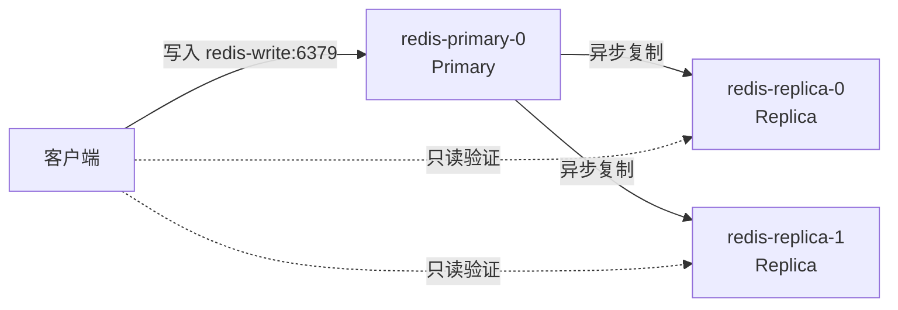
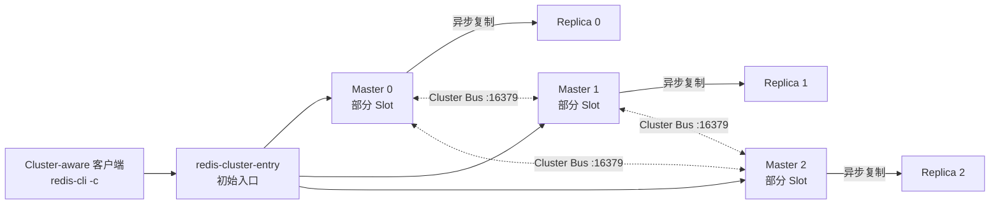

# Redis 主从复制与 Cluster 部署实验

## 一、实验目标

- 解释 Redis Primary、Replica 以及异步复制的关系。
- 部署一主两从 Redis，并验证主库写入、从库读取和从库只读。
- 部署 3 Master、3 Replica 的 Redis Cluster。
- 理解 Redis Cluster 的 Slot、`MOVED`、Cluster-aware 客户端和 Hash Tag。
- 删除一个 Cluster Master Pod，观察其 Replica 自动晋升。
- 说明主从复制与 Redis Cluster 的结构、适用场景和基本限制。

本实验不会修改 `default` 命名空间中现有的业务 Redis。两套实验分别部署在：

```text
redis-replication-lab
redis-cluster-lab
```

> 本实验使用静态 Local PV。每个 Redis Pod 独占一个数据目录；Local PV 与
> 指定 Worker 节点绑定，不能跟随 Pod 迁移到其他节点，也不能代替备份。

## 二、两种模式的区别

| 对比项 | 主从复制 | Redis Cluster |
|---|---|---|
| 数据分布 | 每个节点保存完整数据 | 数据分散到不同 Master |
| 写入口 | 只有一个 Primary | 多个 Master 均可写入各自 Slot |
| 故障切换 | 主从复制本身不负责自动选主 | 满足多数派条件时，Cluster 可以自动提升 Replica |
| 读扩展 | 可以从 Replica 读取 | 可以从对应分片的 Replica 读取 |
| 容量扩展 | 不能突破单机数据容量 | 可以增加 Master 并迁移 Slot |
| 客户端要求 | 普通 Redis 客户端即可 | 必须支持 Redis Cluster |

Redis 默认采用异步复制。Primary 不会等待每一次写入都被 Replica 持久化，因此故障窗口内仍可能丢失少量最新写入。

## 三、实验环境检查

```bash
kubectl get nodes
kubectl get pods -A
kubectl get svc -n default redis-service
```

要求：

- Kubernetes 节点均为 `Ready`且未cordon。
- 两个 Worker 的 `kubernetes.io/hostname` 必须分别为 `node01`、`node02`，与 PV 清单一致。
- node01、node02 能够拉取实验镜像。
- 当前业务 Redis 正常，本实验不删除、不修改它。

本实验使用的密码为：

```text
123456
```

该密码仅供封闭教学环境使用，生产环境必须更换并通过外部 Secret 管理系统保存。

两个 YAML 都把密码以 `REDISCLI_AUTH` 环境变量注入 Redis 容器，因此本课件中的
`kubectl exec ... redis-cli` 命令会自动完成认证。如果在 master01 或其他临时 Pod
中直接运行 `redis-cli`，则必须自行设置 `REDISCLI_AUTH` 或显式提供密码。

### 准备 Local PV 目录

两套实验共使用 9 个数据目录。每个目录只能给一个 Redis Pod 使用，禁止多个
Redis 实例共享同一目录。

在 `node01` 上执行：

```bash
mkdir -p \
  /data/redis-lab/replication/primary-0 \
  /data/redis-lab/replication/replica-1 \
  /data/redis-lab/cluster/node-0 \
  /data/redis-lab/cluster/node-2 \
  /data/redis-lab/cluster/node-4

chown -R 999:999 /data/redis-lab

chmod 770 \
  /data/redis-lab/replication/primary-0 \
  /data/redis-lab/replication/replica-1 \
  /data/redis-lab/cluster/node-0 \
  /data/redis-lab/cluster/node-2 \
  /data/redis-lab/cluster/node-4
```


在 `node02` 上执行：

```bash
mkdir -p \
  /data/redis-lab/replication/replica-0 \
  /data/redis-lab/cluster/node-1 \
  /data/redis-lab/cluster/node-3 \
  /data/redis-lab/cluster/node-5

chown -R 999:999 /data/redis-lab

chmod 770 \
  /data/redis-lab/replication/replica-0 \
  /data/redis-lab/cluster/node-1 \
  /data/redis-lab/cluster/node-3 \
  /data/redis-lab/cluster/node-5
```

Redis 镜像中的进程以 UID/GID `999:999` 运行，所以必须在部署前设置目录权限。

回到 `master01` 创建 StorageClass 和 9 个 Local PV：

```bash
kubectl apply -f /root/resources/redis-ha/redis-local-pv.yaml
kubectl get storageclass redis-local-static
kubectl get pv
```

Local PV 通过 `nodeAffinity` 绑定上述节点和目录，StatefulSet 生成的每个 PVC 也只会绑定
一个 PV。Pod 只能调度到该 PV 所在的节点，不能携带 Local PV 迁移到其他节点。

---

## 四、模式一：一主两从复制

### 1. 架构关系



本模式包含：

- 一个 Primary StatefulSet。
- 一个两副本 Replica StatefulSet。
- 一个 Headless Service，为三个 Redis Pod 提供稳定 DNS。
- 一个 `redis-write` Service，初始指向 `redis-primary-0`。

主从复制负责把 Primary 的数据异步复制到 Replica，但不会自动选举新 Primary。本章只
完成一主两从的部署、角色检查和基础读写验证，不进行故障切换演练。

### 2. 部署主从环境

```bash
kubectl apply -f /root/resources/redis-ha/redis-replication.yaml

kubectl wait -n redis-replication-lab \
  --for=condition=Ready pod \
  -l app.kubernetes.io/part-of=redis-replication-lab \
  --timeout=180s

kubectl get pod,pvc,svc,endpoints -n redis-replication-lab -o wide
```

预期 Pod：

```text
redis-primary-0
redis-replica-0
redis-replica-1
```

三个 PVC 都应为 `Bound`：

```text
redis-data-redis-primary-0
redis-data-redis-replica-0
redis-data-redis-replica-1
```

Pod 会按照 PV 的 `nodeAffinity` 调度到对应节点：Primary 和 `redis-replica-1` 位于
node01，`redis-replica-0` 位于 node02。

### 3. 查看主从角色

查看 Primary：

```bash
kubectl exec -n redis-replication-lab redis-primary-0 -- redis-cli ROLE
```

第一行应为：

```text
master
```

查看两个 Replica：

```bash
for POD in redis-replica-0 redis-replica-1; do
  echo "===== $POD ====="
  kubectl exec -n redis-replication-lab "$POD" -- \
    redis-cli INFO replication | grep -E 'role:|master_host:|master_link_status:'
done
```

预期包含：

```text
role:slave
master_link_status:up
```


### 4. 验证主库写入、从库读取

通过写 Service 向 Primary 写入数据：

```bash
kubectl exec -n redis-replication-lab redis-replica-0 -- redis-cli -h redis-write SET lab:replication:message hello
```

预期返回 `OK`。稍等片刻，再分别从两个 Replica 读取：

```bash
for POD in redis-replica-0 redis-replica-1; do
  kubectl exec -n redis-replication-lab "$POD" -- \
    redis-cli GET lab:replication:message
done
```

两个 Replica 都应返回：

```text
hello
```

尝试直接向 Replica 写入：

```bash
kubectl exec -n redis-replication-lab redis-replica-0 -- \
  redis-cli SET lab:replica:write should-fail
```

预期报错：

```text
READONLY You can't write against a read only replica
```

### 5. 本模式结论

纯主从复制提供一个写节点和多个数据副本，适合读扩展，但所有数据仍需容纳在单个
Primary 中。它本身不提供自动选主，不能直接作为无人值守的生产故障转移方案。

---

## 五、模式二：Redis Cluster

### 1. 架构关系



Redis Cluster 把 Key 空间划分为 16384 个 Slot。三个 Master 分别负责一部分 Slot，每个 Master 配置一个 Replica。

普通 Service 只是客户端初次连接的入口，不是 Redis 代理。客户端收到 `MOVED` 或 `ASK` 后，必须能够直接访问目标 Redis Pod。

### 2. 部署六个 Redis 节点

```bash
kubectl apply -f /root/resources/redis-ha/redis-cluster.yaml

kubectl wait -n redis-cluster-lab \
  --for=condition=Ready pod \
  -l app.kubernetes.io/name=redis-cluster \
  --timeout=300s

kubectl get pod,pvc,svc -n redis-cluster-lab -o wide
```

预期存在：

```text
redis-cluster-0
redis-cluster-1
redis-cluster-2
redis-cluster-3
redis-cluster-4
redis-cluster-5
```

六个 PVC 都应为 `Bound`：

```text
data-redis-cluster-0
data-redis-cluster-1
data-redis-cluster-2
data-redis-cluster-3
data-redis-cluster-4
data-redis-cluster-5
```

此时只有六个启用了 Cluster 功能的 Redis 实例，它们尚未组成同一个集群。

### 3. 初始化 3 Master、3 Replica

按 Pod 序号收集地址：

```bash
NODES=""

for ID in 0 1 2 3 4 5; do
  IP=$(kubectl get pod -n redis-cluster-lab redis-cluster-$ID \
    -o jsonpath='{.status.podIP}')
  NODES="$NODES $IP:6379"
done

echo "$NODES"
```

创建集群：

```bash
kubectl exec -n redis-cluster-lab redis-cluster-0 -- \
  redis-cli --cluster create $NODES \
  --cluster-replicas 1 \
  --cluster-yes
```

`--cluster create` 是“第一次组建集群”的命令，只需要执行一次。它会让六个原本互不
认识的 Redis 组成一个 Cluster，并分配 3 个 Master、3 个 Replica 和 16384 个 Slot。

集群创建成功后，即使 Pod 以后发生重启，也不需要再次执行该命令。Redis 会从
`nodes.conf` 中读取原来的集群关系并重新加入。可以把 `nodes.conf` 理解为 Redis 保存的
“集群通讯录”。不要手工修改它，也不要对已经创建好的集群重复执行 `--cluster create`。

### 4. 验证集群状态

```bash
kubectl exec -n redis-cluster-lab redis-cluster-0 -- redis-cli CLUSTER INFO

kubectl exec -n redis-cluster-lab redis-cluster-0 -- redis-cli CLUSTER NODES
```

重点检查：

```text
cluster_state:ok
cluster_slots_assigned:16384
cluster_slots_ok:16384
```

集群节点中应有三个 `master` 和三个 `slave`，并能看到每个 Master 对应的 Replica。

再运行完整检查：

```bash
FIRST_IP=$(kubectl get pod -n redis-cluster-lab redis-cluster-0 -o jsonpath='{.status.podIP}')

kubectl exec -n redis-cluster-lab redis-cluster-0 -- redis-cli --cluster check "$FIRST_IP:6379"
```

预期包含：

```text
[OK] All 16384 slots covered
```

### 5. 理解 MOVED 和 `-c`

查看 Key `foo` 的 Slot：

```bash
kubectl exec -n redis-cluster-lab redis-cluster-0 -- redis-cli CLUSTER KEYSLOT foo
```

直接连接固定节点写入：

```bash
kubectl exec -n redis-cluster-lab redis-cluster-0 -- redis-cli SET foo bar
```

如果该 Slot 不属于 `redis-cluster-0`，会返回：

```text
MOVED <slot> <目标PodIP>:6379
```

加上 `-c` 后，redis-cli 会跟随重定向：

```bash
kubectl exec -n redis-cluster-lab redis-cluster-0 -- redis-cli -c -h redis-cluster-entry SET foo bar

kubectl exec -n redis-cluster-lab redis-cluster-0 -- redis-cli -c -h redis-cluster-entry GET foo
```

### 6. 验证 Hash Tag 与跨 Slot 限制

花括号内容相同的 Key 会落入同一个 Slot：
Slot计算规则：
存在非空的 {...} → 只计算花括号里的内容
没有 {...}        → 计算整个 Key

```bash
kubectl exec -n redis-cluster-lab redis-cluster-0 -- \
  redis-cli -c -h redis-cluster-entry \
  MSET 'lab:{100}:name' alice 'lab:{100}:score' 90

kubectl exec -n redis-cluster-lab redis-cluster-0 -- \
  redis-cli -c -h redis-cluster-entry \
  MGET 'lab:{100}:name' 'lab:{100}:score'
```

花括号内容不同会落入不同 Slot，多 Key 操作将失败：

```bash
kubectl exec -n redis-cluster-lab redis-cluster-0 -- \
  redis-cli -c -h redis-cluster-entry \
  MSET 'lab:{100}:a' 1 'lab:{200}:b' 2
```

预期报错：

```text
CROSSSLOT Keys in request don't hash to the same slot
```

### 7. 简单故障演练

只有在上一节确认 6 个 Pod 均为 `Ready`、集群为 `cluster_state:ok` 且 16384 个 Slot
全部正常后，才能开始本实验。

先查看六个 Pod 的角色：

```bash
for ID in 0 1 2 3 4 5; do
  echo -n "redis-cluster-$ID: "
  kubectl exec -n redis-cluster-lab redis-cluster-$ID -- \
    redis-cli --raw ROLE | sed -n '1p'
done
```

选择一个显示为 `master` 的 Pod 作为故障目标，再选择另一个正常 Pod 观察集群。
下面假设 `redis-cluster-0` 是 Master：

```bash
TARGET=redis-cluster-0
OBSERVER=redis-cluster-1

test "$TARGET" != "$OBSERVER"

test "$(kubectl exec -n redis-cluster-lab "$TARGET" -- \
  redis-cli --raw ROLE | sed -n '1p')" = master

kubectl exec -n redis-cluster-lab "$TARGET" -- \
  test -f /data/nodes.conf

kubectl exec -n redis-cluster-lab "$OBSERVER" -- \
  redis-cli CLUSTER NODES
```

上面三项检查都成功后再继续。`TARGET` 必须确实为 Master，`OBSERVER` 必须是另一个
正常 Pod，并且目标 Pod 中已经存在初始化 Cluster 时生成的 `nodes.conf`。

删除目标 Master Pod：

```bash
kubectl delete pod -n redis-cluster-lab "$TARGET"
```

观察集群角色变化；看到原 Master 对应的 Replica 变成 `master` 后，按 `Ctrl+C`：

```bash
watch -n 1 "kubectl exec -n redis-cluster-lab $OBSERVER -- redis-cli CLUSTER NODES"
```

Redis Cluster 自动选主的大致过程如下：


本实验配置的 `cluster-node-timeout` 是 5 秒。只有 Master 持续不可用，并且对应
Replica 获得多数 Master 的同意，才会发生晋升。如果原 Master 很快恢复，集群可能
认为没有必要切换，Replica 就不会晋升。

Cluster YAML 会让保存过 `nodes.conf` 的 Pod 在重建时等待 20 秒。这是课堂专用设置，
用于给其他节点留出故障判断和选举时间，使单条 `kubectl delete pod` 可以稳定演示
Replica 晋升。

验证集群仍可读写：

```bash
kubectl exec -n redis-cluster-lab "$OBSERVER" -- \
  redis-cli -c -h redis-cluster-entry \
  SET lab:cluster:after success

kubectl exec -n redis-cluster-lab "$OBSERVER" -- \
  redis-cli -c -h redis-cluster-entry \
  GET lab:cluster:after
```

预期看到返回 `OK` 和 `success`。
这个实验只模拟单个 Redis Pod 故障，不代表整个 Worker 节点故障。

### 8. 本模式结论

Redis Cluster 将 16384 个 Slot 分配给多个 Master，可以横向拆分数据和写入压力。
每个 Master 配置一个 Replica，用于保存该分片的数据副本。客户端必须支持 Cluster
协议并处理 `MOVED`、`ASK` 等重定向。

本实验的六个 Redis Pod 只分布在 node01、node02 两个 Worker 上，用于认识 Cluster
结构，不代表生产级节点高可用。生产环境通常至少使用三个独立故障域，并确保每个
Master 与自己的 Replica 位于不同节点。

---

## 六、扩展阅读：生产环境还需考虑什么

课堂不操作以下内容，但生产环境必须继续考虑：

### 1. 持久化与恢复

- 本实验已为每个 Redis Pod 提供独立的 Local PV 和 PVC，用于保存 AOF、RDB 和 Cluster `nodes.conf`。
- 使用 AOF 不代表不会丢数据，仍需定期备份并演练恢复。
- Replica 不是备份，误删除和错误写入也会复制到 Replica。
- Local PV 不能跟随 Pod 移动，节点故障后的可用性依赖其他节点上的 Replica；生产环境还应评估远端或动态存储方案。

### 2. 调度与故障域

- 至少准备三个独立 Worker。
- 使用 Pod 反亲和或拓扑分布约束。
- 保证每个 Master 与自己的 Replica 位于不同节点。
- PodDisruptionBudget 只能限制自愿中断，不能防止节点突然故障。

### 3. 客户端与业务接入

- 主从模式需要明确的人工切换流程或外部自动化控制面。
- Cluster 模式必须使用支持 Slot、`MOVED` 和 `ASK` 的客户端。
- Redis Cluster 只支持数据库 0。
- 多 Key 操作必须使用合理的 Hash Tag 设计。
- 现有 Discuz Redis 驱动不是 Redis Cluster 客户端，本实验不要直接将 Discuz 切换到 Cluster。

### 4. 扩缩容

Redis Cluster 扩容不能只执行 `kubectl scale`。正确流程为：

```text
准备新节点及存储
→ 启动新 Redis 实例
→ 将节点加入 Cluster
→ 迁移部分 Slot
→ 校验数据和集群状态
```

缩容前必须先迁走目标 Master 持有的 Slot，再把节点安全移出 Cluster。


## 八、思考题

1. Primary 与 Replica 分别承担什么角色，为什么写 Service 只指向 Primary？
2. StatefulSet、PVC、StorageClass、Local PV 和节点本地目录之间是什么关系？
3. Redis Cluster 为什么要把 Key 划分到 16384 个 Slot？
4. Redis Cluster 客户端为什么必须能够处理 `MOVED`？
5. Hash Tag 解决了哪类多 Key 操作问题？
6. 为什么主从复制不会自动选主，而 Redis Cluster 可以自动提升 Replica？
7. 为什么 3 Master、3 Replica 部署在两个 Worker 上仍不代表生产级节点高可用？
