# 实验环境

## 环境介绍

```
master01 10.3.201.100
node01 10.3.201.101
node02 10.3.201.102

master01节点为本集群的NFS服务端
```

## 镜像配置

### 创建虚拟机

镜像下载地址：https://pan.quark.cn/s/5f61d1ff58f8

1. 从提供的三个文件夹(master01、node01、node02)中依次打开后缀为.ovf的文件
   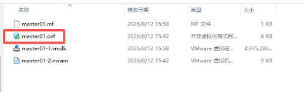

2. 取个名字，和hostname一致即可。存储路径放一个空文件夹且需要路径全英文即可。最后点击导入

   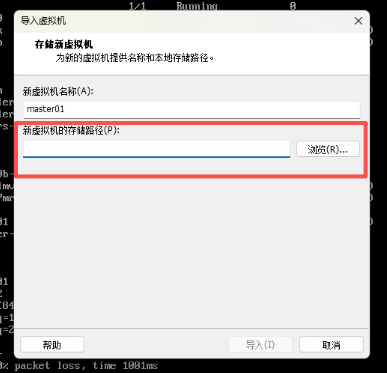

### 网络配置

1. 在vmware workstation中找到虚拟网络编辑器

   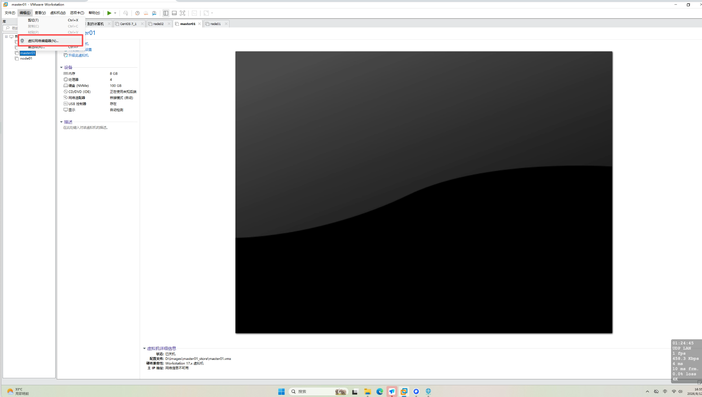

2. 更改设置

   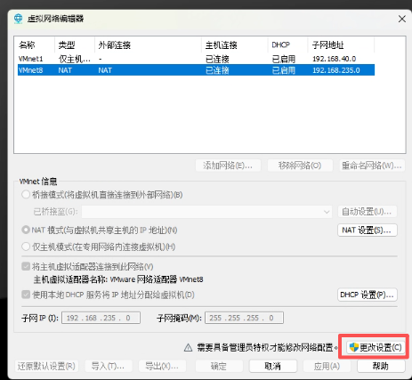

3. 选择 `VMnet8`，配置：

   ```
   类型：NAT
   子网 IP：10.3.0.0
   子网掩码：255.255.0.0
   ```

   进入“NAT 设置”，把网关设为：

   ```
   10.3.200.254
   ```

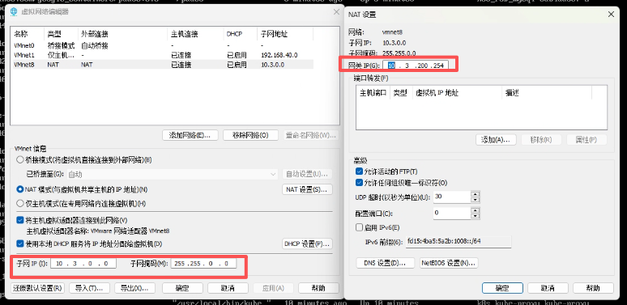

4. 将**每台**虚拟机都设置：

   ```
   虚拟机设置 → 网络适配器
   → 自定义：特定虚拟网络
   → VMnet8
   ```

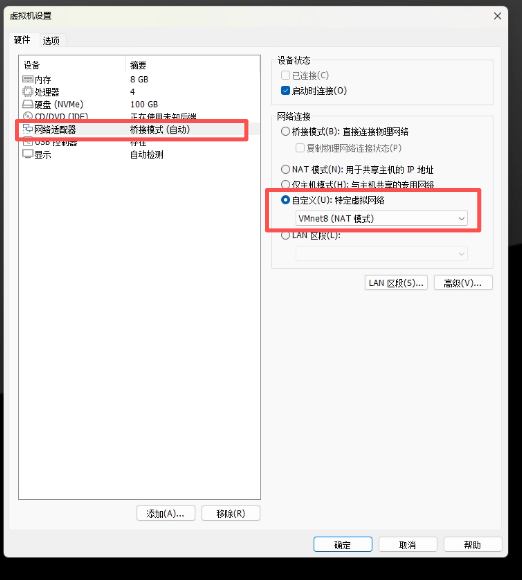

5. 将vmnet8网卡启用

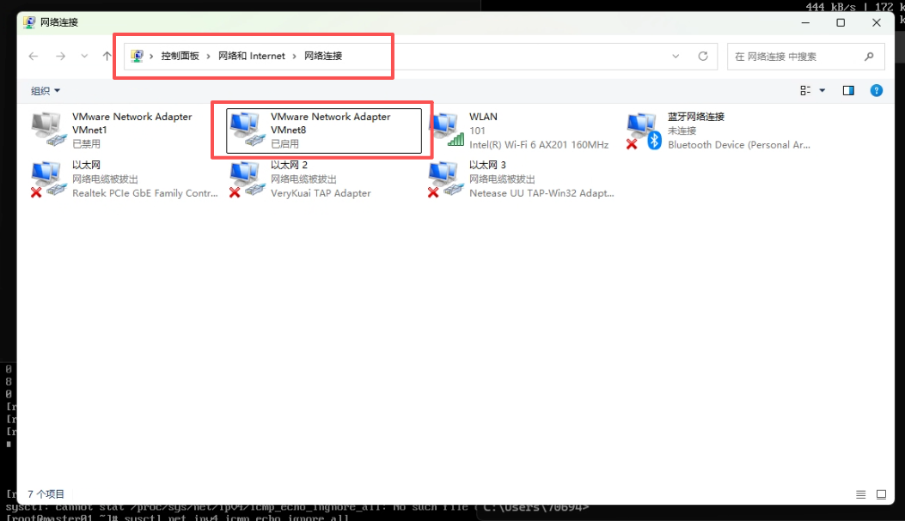

### 环境测试

1. 将master01、node01、node02按顺序开机

2. 登陆master01节点（账号：root、密码：1）

3. 尝试ping www.baidu.com，验证网络是否正常。若发包速度较慢，尝试修改DNS

   ```bash
   nmcli connection modify ens160 ipv4.dns "223.5.5.5 119.29.29.29"
   nmcli connection up ens160
   ```

4. 输入docker ps 、 kubectl get nodes 、kubectl get pods -A 是否正常

   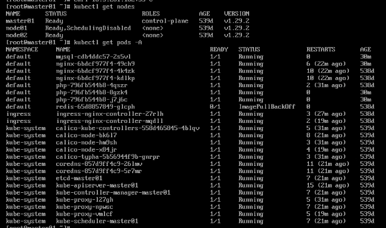

   - 若不正常，重启master和node节点上的docker和kubelet

     ```bash
     systemctl restart docker
     systemctl restart kubelet
     ```

   - pods恢复时间可能较长

5. 在master上执行curl -I -H "host: bbs.iproute.cn" 10.3.201.101:30331，预期返回200

6. **记得打一个init快照**

  

# 故障排查和业务需求

## 1.K8s 集群异常

前置条件: IP 冲突，需要将 IP 修改为10.3.204.x网段的IP
异常现象: `kubectl get nodes -o wide`

1. INTERNAL-IP 字段变化
2. `dial tcp 10.3.201.100:6443: connect: no route to host`
3. `Unable to connect to the server: tls: failed to verify certificate: x509: certificate is valid for 10.0.0.1, 10.3.201.100, not 10.3.204.100`

**控制节点**

```shell
# 更新Kubernets核心配置
sed  -i 's/10.3.201/10.3.204/g' /etc/kubernetes/manifests/etcd.yaml
sed  -i 's/10.3.201/10.3.204/g' /etc/kubernetes/manifests/kube-apiserver.yaml
sed  -i 's/10.3.201/10.3.204/g' /etc/kubernetes/admin.conf
sed  -i 's/10.3.201/10.3.204/g' /etc/kubernetes/controller-manager.conf
sed  -i 's/10.3.201/10.3.204/g' /etc/kubernetes/kubelet.conf
sed  -i 's/10.3.201/10.3.204/g' /etc/kubernetes/scheduler.conf
sed  -i 's/10.3.201/10.3.204/g' /etc/kubernetes/super-admin.conf
sed  -i 's/10.3.201/10.3.204/g' $HOME/.kube/config
# 重新生成证书:
mkdir backup && mv /etc/kubernetes/pki/apiserver.{key,crt} backup/
kubeadm init phase certs apiserver
# 重启服务
systemctl restart docker kubelet
# 更新cluster-info CM: 将旧IP改为新IP
# 保证后续新节点使用kubeadm成功join集群
kubectl -n kube-public edit cm cluster-info 
```

**其他操作**

```shell
# 驱除工作节点
kubectl drain node02 --ignore-daemonsets --delete-emptydir-data
# 强制删除Pod, 可以通过-n指定命名空间
kubectl delete pod $(kubectl get pods -A -o wide | grep node02 | awk '{print $2}') --force
# 设置为不可调度
kubectl cordon node01
# 设置为可调度
kubectl uncordon node01
# 生成加入集群的方式
kubeadm token create --print-join-command
```

**工作节点**

异常现象: `kubectl get nodes -o wide`

1. INTERNAL-IP 字段不符合预期
2. `error execution phase preflight: unable to fetch the kubeadm-config ConfigMap: failed to get config map: Get "https://10.3.201.100:6443/api/v1/namespaces/kube-system/configmaps/kubeadm-config?timeout=10s": dial tcp 10.3.201.100:6443: connect: no route to host`
3. 使用方法 2: `token.go:223] [discovery] The cluster-info ConfigMap does not yet contain a JWS signature for token ID "wsceet", will try again`
4. reset的时候报错：`[reset] Unmounting mounted directories in "/var/lib/kubelet"
   W0808 20:40:35.284494  190290 unmount_linux.go:49] [reset] Failed to unmount mounted directory in /var/lib/kubelet/: /var/lib/kubelet/pods/9adbd46f-fad0-4689-a907-3abbe2b4fde0/volumes/kubernetes.io~nfs/config`

**方式 1（node01）**

```shell
# 更新配置文件
sed -i 's/10.3.201/10.3.204/g' /etc/kubernetes/kubelet.conf
# 重启服务
systemctl restart docker kubelet
# 开启node01节点调度
kubectl uncordon node01
```

**方式 2（node02）**

Master IP变更后，node02 仍挂载旧 IP（10.3.201.100）的 NFS，导致文件系统阻塞（df -h无输出）、kubelet卡住，节点变成 NotReady。所以无法通过只更新配置文件（方式1）的方法恢复

```bash
[root@node02 ~]# findmnt -rn -o TARGET,SOURCE,FSTYPE | grep nfs
/var/lib/nfs/rpc_pipefs sunrpc rpc_pipefs
/var/lib/kubelet/pods/40005dd7-cd03-4a99-8c19-8e21a65298b4/volumes/kubernetes.io~nfs/config 10.3.201.100:/root/data/nfs/php nfs4
/var/lib/kubelet/pods/9adbd46f-fad0-4689-a907-3abbe2b4fde0/volumes/kubernetes.io~nfs/html 10.3.201.100:/root/data/nfs/html nfs4
/var/lib/kubelet/pods/9adbd46f-fad0-4689-a907-3abbe2b4fde0/volumes/kubernetes.io~nfs/config 10.3.201.100:/root/data/nfs/nginx nfs4
/var/lib/kubelet/pods/40005dd7-cd03-4a99-8c19-8e21a65298b4/volumes/kubernetes.io~nfs/html 10.3.201.100:/root/data/nfs/html nfs4
/var/lib/kubelet/pods/2f1bcfb9-59ba-46d0-9393-16506124e5d3/volumes/kubernetes.io~nfs/config 10.3.201.100:/root/data/nfs/nginx nfs4
/var/lib/kubelet/pods/2f1bcfb9-59ba-46d0-9393-16506124e5d3/volumes/kubernetes.io~nfs/html 10.3.201.100:/root/data/nfs/html nfs4
# 可以看到挂载了很多10.3.201.100的NFS
```

操作方法：

```shell
# 重置节点
kubeadm reset -f --cri-socket ///var/run/cri-dockerd.sock

# 若出现异常现象4 说明还有残余NFS未卸载。查看节点上是否还有残留NFS未清除
findmnt -rn -o TARGET,SOURCE,FSTYPE | grep nfs
/var/lib/nfs/rpc_pipefs sunrpc rpc_pipefs
/var/lib/kubelet/pods/9adbd46f-fad0-4689-a907-3abbe2b4fde0/volumes/kubernetes.io~nfs/config 10.3.201.100:/root/data/nfs/nginx nfs4
# 卸载NFS挂载点
umount -i -l -- '/var/lib/kubelet/pods/9adbd46f-fad0-4689-a907-3abbe2b4fde0/volumes/kubernetes.io~nfs/config'
# 确认NFS挂载点已经全部被卸载
findmnt -rn -o TARGET,SOURCE,FSTYPE | grep nfs

rm -rf /etc/kubernetes /var/lib/kubelet
rm -rf /etc/kubernetes/
rm -rf /var/lib/kubelet/
rm -rf $HOME/.kube/config
rm -rf /etc/cni/net.d/ && rm -rf /var/lib/cni/
iptables -F && iptables -t nat -F && iptables -t mangle -F && iptables -X
ip route flush proto bird
# 关于异常现象3 kube-proxy 在 cluster-info cm 更新后需要重建才能生效；查看 kube-proxy pod 的日志时发现还有旧IP存在（在master节点上操作）
kubectl delete pod -n kube-system -l k8s-app=kube-proxy --force
# 等待 kube-proxy pod 重建完成
# 生成join命令（在master节点上操作）
kubeadm token create --print-join-command
# 重新加入到集群中
kubeadm join 10.3.204.100:6443 --token vjwr1p.nm5ylfw81b6n67u6 --discovery-token-ca-cert-hash sha256:9e2991ca808a6559040fceedad3aa30e15500dd7a02668d146b002c3fddef3fa --cri-socket unix:///var/run/cri-dockerd.sock
```

## 2.Calico 组件异常

异常现象:

1. `2025-04-18 07:37:19.470 [FATAL][1] cni-installer/<nil> <nil>: Unable to create token for CNI kubeconfig error=Post "https://10.0.0.1:443/api/v1/namespaces/kube-system/serviceaccounts/calico-cni-plugin/token": dial tcp 10.0.0.1:443: i/o timeout`
2. `failed to verify certificate: x509: certificate is valid for 10.96.0.1, 10.3.204.100, not 10.0.0.1`

```shell
# 查看install-cni container的日志
kubectl logs calico-node-zqpbp -n kube-system -c install-cni
# 更新kube-proxy CM: 将旧IP改为新IP
kubectl -n kube-system edit cm kube-proxy
# 查看crt文件SAN地址
openssl x509 -in /etc/kubernetes/pki/apiserver.crt -text | grep -A 1 'X509v3 Subject Alternative Name'
# 将10.0.0.1加入SANs中 
	# 10.0.0.1是集群创建后的第一个service，名字是kubernetes，集群pod会通过这个service访问apiserver。所以这个service的ip必须在SAN中
[root@master01 ~]# cat kubeadm_config.yaml
apiVersion: kubeadm.k8s.io/v1beta3
kind: ClusterConfiguration
apiServer:
  certSANs:
    - "10.3.204.100"
    - "10.0.0.1"
mv /etc/kubernetes/pki/apiserver.{key,crt} backup/
# --config kubeadm-conf.yaml可以指定配置文件
kubeadm init phase certs apiserver --config kubeadm_config.yaml
# 重建kube-proxy & 重建calico
kubectl delete pod -n kube-system -l k8s-app=kube-proxy
kubectl delete pod -n kube-system -l k8s-app=calico-node
kubectl delete pod -n kube-system -l k8s-app=calico-kube-controllers
kubectl delete pod -n kube-system -l k8s-app=calico-typha
```

## 3.LNMP 业务异常

- 将 `/root/resources/01.nginx.yaml,02.phpfpm.yaml,03.mysql.yaml` 等文件中 NFS 地址指向本集群 master01
- 为 `nginx.yaml,phpfpm.yaml` 等文件添加健康检查机制
- 检查 `nginx php-fpm mysql` 服务
- 通过 `bbs.iproute.cn` 访问正常
<!-- - 修改`service/ingress-nginx-controller`为`NodePort`方式并通过`helm`更新 -->

```shell
# 更改NFS地址
sed -i 's/3.201/3.204/g' resources/01.nginx.yaml
sed -i 's/3.201/3.204/g' resources/02.phpfpm.yaml
sed -i 's/3.201/3.204/g' resources/03.mysql.yaml
kubectl apply -f resources/01.nginx.yaml
kubectl apply -f resources/02.phpfpm.yaml
kubectl apply -f resources/03.mysql.yaml
# 添加健康检查机制: 参考v2.yaml文件
# 访问1: bbs.iproute.cn 带端口
[root@master01 ～]# curl -H "host: bbs.iproute.cn" 10.3.204.101:`kubectl get svc/ingress-nginx-controller -n ingress-nginx -o jsonpath="{.spec.ports[?(@.port==80)].nodePort}" -n ingress`
# 访问2: 直接通过域名访问，不带端口
[root@master01 ~]# grep bbs /etc/hosts
10.3.204.101 bbs.iproute.cn
[root@master01 ~]# curl -I bbs.iproute.cn
HTTP/1.1 200 OK
```

访问不同IP/Domain及Port的访问路径

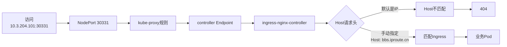

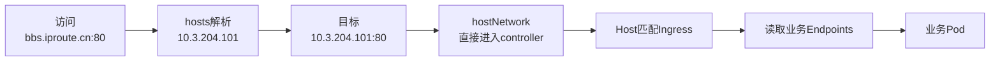

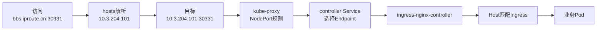

## 4.MySQL 变更管理

前置条件:

- 新密码为: `123456`
  异常现象:
- 看到 `nginx pod` 健康检查失败
- 访问 `bbs.iproute.cn` 异常 `HTTP/1.1 503`

```shell
# 更新MySQL用户密码
kubectl exec -it mysql-776786446d-bjcnn -- /bin/bash
mysql -uroot -p123
ALTER USER 'root'@'localhost' IDENTIFIED BY '123456';
ALTER USER 'root'@'%' IDENTIFIED BY '123456';
FLUSH PRIVILEGES;
# 容器内: 日志文件路径
/usr/share/nginx/html/data/log/
# NFS: 日志文件路径
/root/data/nfs/html/data/log/
# NFS: 配置文件路径
[root@master01 resources]# grep -nrw '123456' /root/data/nfs/html/*
/root/data/nfs/html/config/config_global.php:9:$_config['db'][1]['dbpw'] = '123456';
/root/data/nfs/html/uc_server/data/config.inc.php:4:define('UC_DBPW', '123456');
/root/data/nfs/html/config/config_ucenter.php:9:define('UC_DBPW', '123456');
# 重启/删除php相关应用
# 测试验证
[root@master01 ~]# curl -I bbs.iproute.cn
HTTP/1.1 200 OK
```

## 5.Redis 持久化管理

- 配置文件通过 Configmap 挂载至 `/usr/local/etc/redis/redis.conf`
- 数据目录通过 NFS 挂载至 `/data`
- 测试验证

```shell
# 使用04.redis_v2.yaml文件
mkdir -pv  /root/data/nfs/redis/data
kubectl apply -f resources/04.redis_v2.yaml
# 进入容器写入测试数据
kubectl exec -it $(kubectl get pods -l app=redis -o jsonpath='{.items[0].metadata.name}') -- redis-cli
> SET testkey "persistence_verified"
> SAVE
# 文件持久化
[root@master01 ~]# tree data/nfs/redis/data/
data/nfs/redis/data/
├── appendonlydir
│   ├── appendonly.aof.1.base.rdb
│   ├── appendonly.aof.1.incr.aof
│   └── appendonly.aof.manifest
└── dump.rdb
# 删除 Pod 触发重建后验证数据
kubectl delete pod $(kubectl get pods -l app=redis -o jsonpath='{.items[0].metadata.name}')
kubectl exec $(kubectl get pods -l app=redis -o jsonpath='{.items[0].metadata.name}') -- redis-cli GET testkey
persistence_verified
```

## 6.新增工作节点

node03镜像从下载的images文件夹中获取，镜像配置参考[镜像配置](#镜像配置)

参考课件`安装手册`

## 7.水平扩缩容

参考课件`HPA控制器`

## 扩展部分

**做扩展内容前，可以把三个节点快照恢复到init，课件及相关yaml文件中的IP地址都是以init快照的IP（10.3.201.x）为准。若不恢复快照接着基础部分做，注意修改yaml模版及课件相关命令中的IP地址。**

### [扩展]1. master高可用

**参考课件[master-ha](resources/master-ha/master-ha.md)**

**注意：此试验需要同时启用5台虚拟机，内存推荐至少需要16GB，8GB机器可能无法完成试验**

#### 1. 16GB机器推荐配置

建议给虚拟机总共分配 `12G`，给 macOS/Windows 和 VMware 留 `4G`：

| 虚拟机   | 内存 | 说明                          |
| -------- | ---- | ----------------------------- |
| master01 | 3G   | 原 Master，还承担主要实验操作 |
| master02 | 2G   | 新增控制平面                  |
| master03 | 2G   | 新增控制平面                  |
| node01   | 2.5G | 运行业务 Pod                  |
| node02   | 2.5G | 运行业务 Pod                  |
| 合计     | 12G  | 宿主机剩余约 4G               |

若16GB机器上有时也出现OOM的情况，可以把业务Pod都删掉

#### 2. 8GB 机器

| 虚拟机   | 内存  |
| -------- | ----- |
| master01 | 1.5G  |
| master02 | 1.25G |
| master03 | 1.25G |
| node01   | 1G    |
| node02   | 1G    |
| 合计     | 6G    |

这个方案可能出现：

- kubeadm 内存预检失败。
- apiserver 或 etcd 被 OOM Kill。
- Calico、kube-proxy 启动缓慢。
- VMware 导致宿主机大量使用 Swap。
- 一部署 MySQL或Redis就内存不足。

因此，8GB 机器建议改为：

**只同时启动三台 Master，完成 HA 实验。业务POD都可以删掉**

### [扩展]2.垂直扩缩容

参考课件[VPA](resources/VPA/vpa.md)

### [扩展]3.MySQL 高可用

参考课件[mysql-ha](resources/mysql高可用/mysql-ha.md)

### [扩展]4.Redis 高可用

参考课件[redis](resources/redis-ha/redis-ha.md)

## 相关命令汇总

```shell

# 获取CA证书哈希值
[root@master01 ~]# openssl x509 -pubkey -in /etc/kubernetes/pki/ca.crt | openssl rsa -pubin -outform der 2>/dev/null | openssl dgst -sha256 -hex | sed 's/^.* //'
9e2991ca808a6559040fceedad3aa30e15500dd7a02668d146b002c3fddef3fa


```
